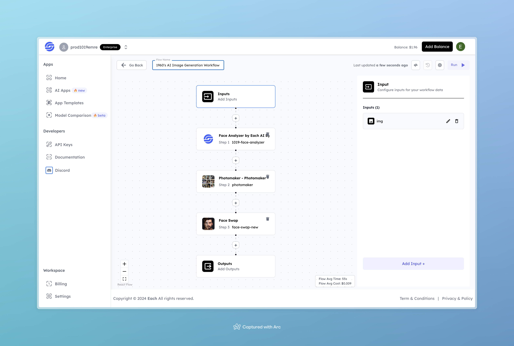

# 1960's AI Image Generation Workflow

## Overview

Generate Realistic Images with Flux using Eachlabs workflows—easily integrate lifelike image generation into your web and mobile applications with Eachlabs API.

---

## Features

- **Face Analyzer by Each AI**: Analyzes and prepares the input face for transformation.  
- **Photomaker**: Refines and enhances the image to match the 1960's aesthetic.  
- **Face Swap**: Generates realistic outputs with transformed features and face details.

---

## Inputs

### 1. `img`  
- **Type:** File  
- **Title:** Input Image  
- **Component:** Image Upload  

**Description:** Upload the image of the individual to generate a 1960's-style transformation.

---

## Example Input and Output

### Input  
  

---

### Output  
  

---

## Conclusion

If you encounter an error, you can join our <b><a href="https://discord.com/invite/yzZD4ZxBPt" target="_blank">Discord</a></b> server.