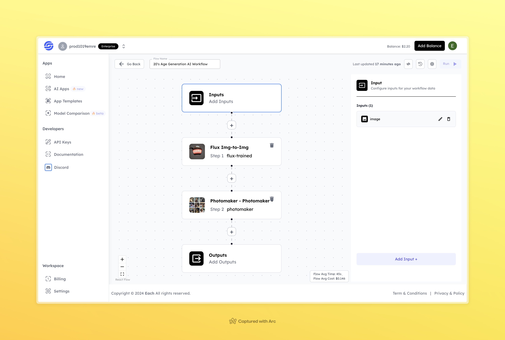

# 20's Age Generation AI Workflow

## Overview

Generate 20's Age Generation with AI Workflow using Eachlabs—seamlessly integrate age transformation features into your web and mobile applications with Eachlabs API.

---

## Features

- **Flux Img-to-Img**: Transforms input images based on age-specific model training.  
- **Photomaker**: Enhances and refines the generated images for realism and detail.  
 
---

## Inputs

### 1. `image`  
- **Type:** File  
- **Title:** Input Image  
- **Component:** Image Upload  

**Description:** Upload the image of the individual you want to transform into their 20's appearance.

## Example Input and Output

### Input  

  

---

### Output  
 
  

---

## Conclusion

If you encounter an error, you can join our <b><a href="https://discord.com/invite/yzZD4ZxBPt" target="_blank">Discord</a></b> server.
