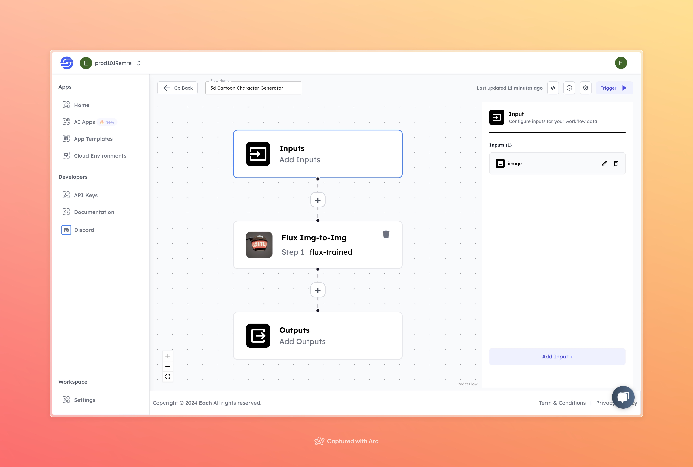

# 3D-Cartoon Image Generation Worfklow

## Overview
Generate 3D-Cartoon Images using Eachlabs workflows—seamlessly integrate 3D-cartoon style image generation into your web and mobile applications with Eachlabs API.

## Features
- **3D Cartoon Character Generation**
- **User-Friendly Interface**
- **High-Quality Cartoon Output**

## Use Cases
- Creation of personalized cartoon avatars
- Content generation for social media profiles
- Fun, creative personal projects

## Inputs

### 1. `image`
- **Type:** Image file
- **Title:** Input Image
- **Component:** Input field

**Description:** The input field requires an image file that will be transformed into a 3D cartoon character. Supported formats include `.jpg`, `.png`, and other common image types.

## Usage

Simply upload an image, and the AI model will process it to generate a 3D cartoon character based on the input. A clear, high-quality input image will result in the best output.

## Examples

### Input

### Output

## Conclusion

If you encounter an error, you can join our <b><a href="https://discord.com/invite/yzZD4ZxBPt" target="_blank">Discord</a></b> server.
