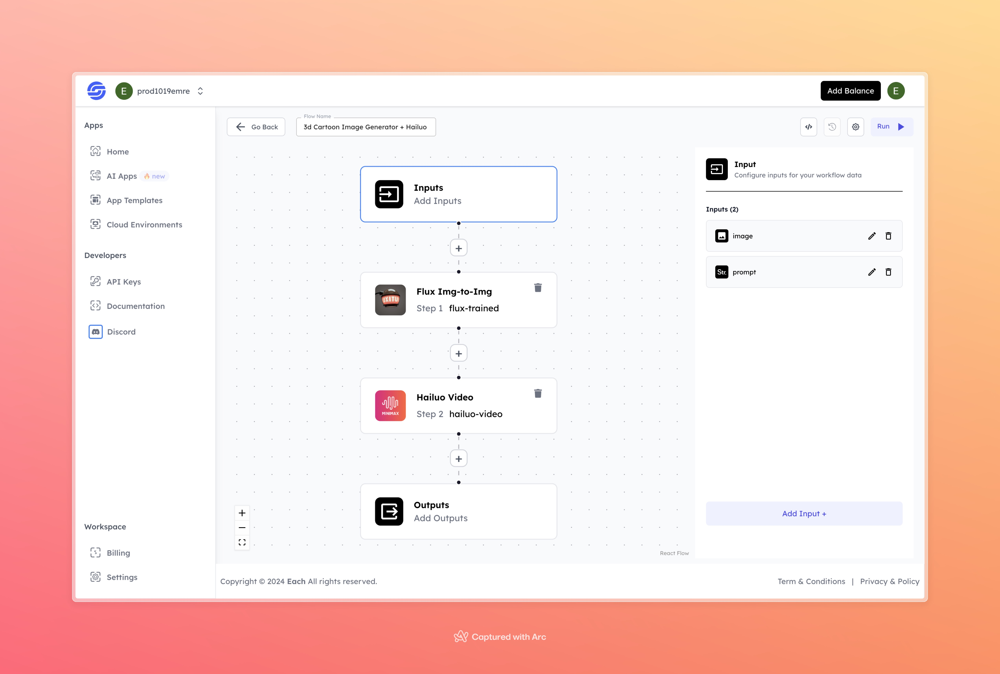

# 3D Cartoon Image Generator + Hailuo

## Overview
The 3D Cartoon Image Generator + Hailuo tool takes an input image and transforms it into a 3D cartoon-style character based on the given prompt. After creating the cartoon character, the system automatically generates an animated video.

## Features
- **Image-to-3D Cartoon Conversion** using Flux Img-to-Img
- **Automatic Anime-Style Video Creation** with Hailuo Video

## Use Cases
- Create custom 3D cartoon avatars or characters
- Turn images into animated short clips
- Personalize cartoon content for storytelling or commercial purposes

## Inputs

### 1. `image`
- **Type:** File 
- **Title:** Image
- **Component:** Image Upload

**Description:** Upload an image that will be transformed into a 3D cartoon character. This image serves as the base for the generated animation.

### 2. `prompt`
- **Type:** String
- **Title:** Prompt
- **Component:** Input field

**Description:** A short text prompt that describes the story or scene that will guide the creation of the cartoon character and the animation.

## Example 

### Input
- **Image:** 

- **Prompt:** a talking 
### Output
- **Video:** 
[Output Video](https://storage.googleapis.com/magicpoint/github-outputs/3d-cartoon-image-generator-hailuo-github-output.mp4)
## Conclusion

For any issues or feedback, please join our <b><a href="https://discord.com/invite/yzZD4ZxBPt" target="_blank">Discord</a></b> server to get help from the community.
