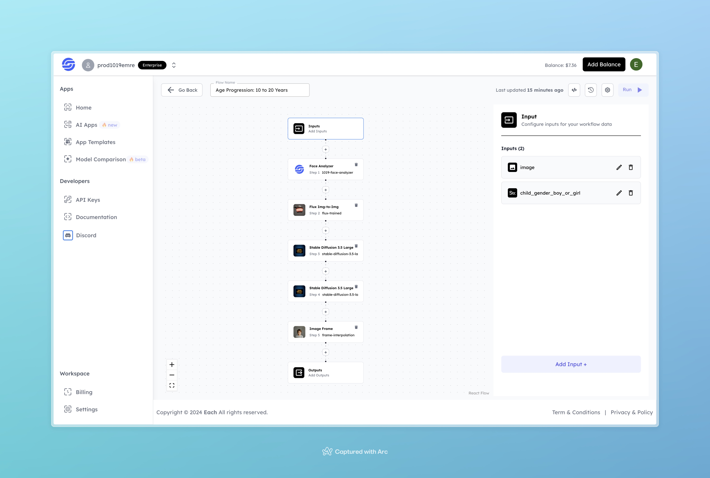

# Age Progression: 10 to 20 Years

## Overview
The Age Progression tool creates a visual progression that simulates aging from childhood (10 years) to young adulthood (20 years). This workflow utilizes face analysis, image-to-image transformations, and frame interpolation to produce a natural and realistic age transition.

## Features
- **Face Analysis** with 1019-Face-Analyzer to identify and analyze key facial features for accurate age progression.
- **Image Transformation** using Flux Img-to-Img and Stable Diffusion models to gradually age the individual in the image.
- **Frame Interpolation** for smooth transitions between age stages.

## Inputs

### 1. image
- **Type:** File
- **Description:** The base image of the individual to be used as the starting point for age progression.

### 2. child_gender_boy_or_girl
- **Type:** Text
- **Description:** Specifies the gender of the child in the input image. Accepted values are "boy" or "girl."

## Example

### Input
- **Image:** 

- **child_gender_boy_or_girl:** girl

### Output
[Output Video](https://storage.googleapis.com/magicpoint/github-outputs/age-transition-10-to-20-output.mp4)

## Conclusion
If you encounter an error, you can join our <b><a href="https://discord.com/invite/yzZD4ZxBPt" target="_blank">Discord</a></b> server.
