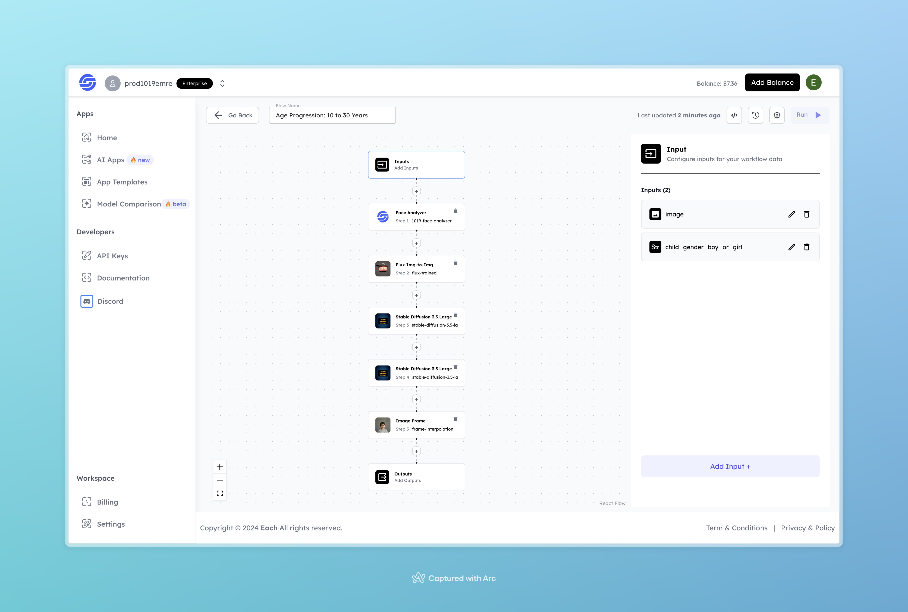

# Age Progression: 10 to 30 Years

## Overview
The Age Progression tool generates a visual sequence that simulates the aging process from childhood (10 years) to young adulthood (30 years). This workflow applies face analysis, image-to-image transformations, and frame interpolation to create a seamless and realistic aging transition.

## Features
- **Face Analysis** using 1019-Face-Analyzer to capture key facial features for age progression.
- **Image Transformation** via Flux Img-to-Img and Stable Diffusion models to gradually age the face in the image.
- **Frame Interpolation** for smooth transitions between different ages.

## Inputs

### 1. image
- **Type:** File 
- **Description:** The initial photo of the individual to be used as the base for age progression.

### 2. child_gender_boy_or_girl
- **Type:** Text 
- **Description:** Gender of the child in the input image. Options are "boy" or "girl."

## Example

### Input
- **Image:** 

- **child_gender_boy_or_girl:** girl

### Output
[Output Video](https://storage.googleapis.com/magicpoint/github-outputs/age-progression-10-to-30-output.mp4)

## Conclusion
If you encounter an error, you can join our <b><a href="https://discord.com/invite/yzZD4ZxBPt" target="_blank">Discord</a></b> server.
