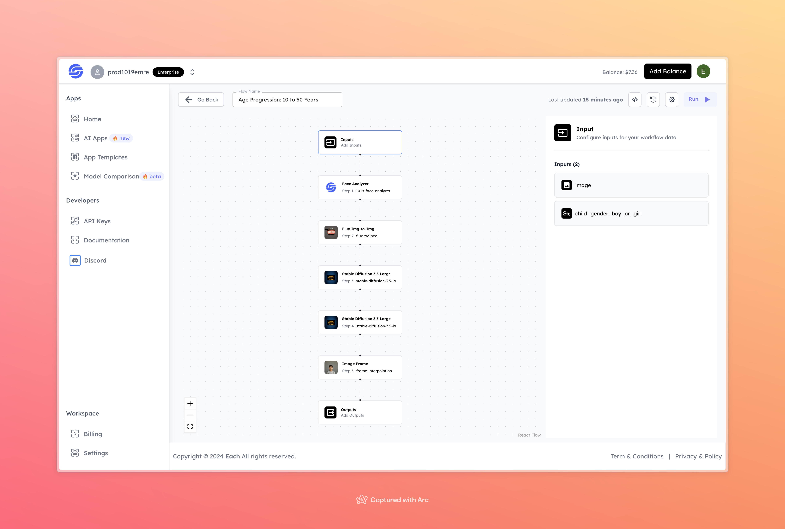

# Age Progression: 10 to 50 Years

## Overview
The Age Progression tool generates a sequence of images that visualize the aging process from childhood to middle age. Using face analysis, img-to-img transformations, and frame interpolation, it provides a realistic aging simulation over time.

## Features
- **Face Analysis** with 1019-Face-Analyzer
- **Image Transformation** with Flux Img-to-Img and Stable Diffusion models
- **Frame Interpolation** for smooth age transitions

## Inputs

### 1. image
- **Type:** File 
- **Description:** Upload an image of the person to be used in the age progression.

### 2. child_gender_boy_or_girl
- **Type:** Text 
- **Description:** Specify the gender of the child (options: "boy" or "girl").

## Example

### Input
- **Image:** 

- **child_gender_boy_or_girl:** girl

### Output
[Output Video](https://storage.googleapis.com/magicpoint/github-outputs/age-progression-10-to-50-output.mp4)

## Conclusion
If you encounter an error, you can join our <b><a href="https://discord.com/invite/yzZD4ZxBPt" target="_blank">Discord</a></b> server.
