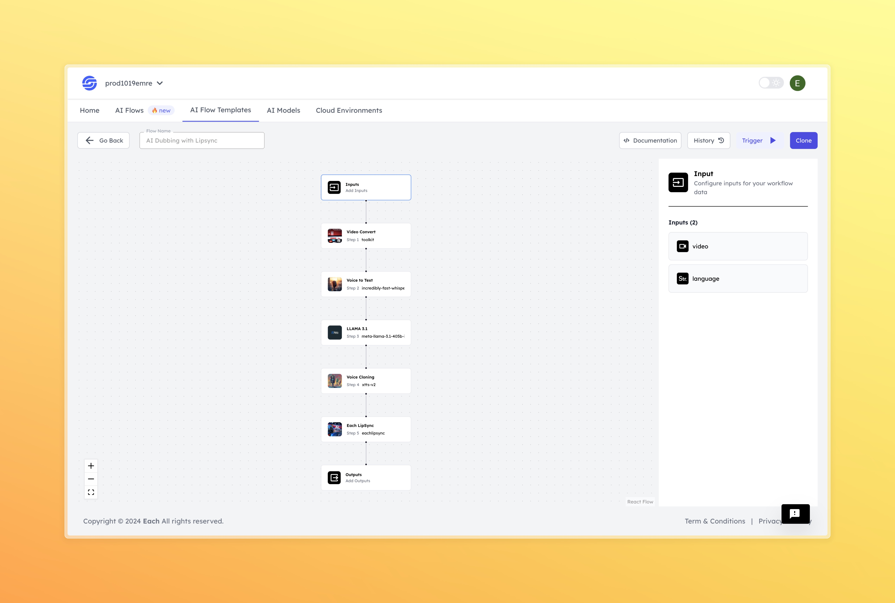

# AI Dubbing With Lipsync

## Overview

Create AI Dubbing with Lipsync using Eachlabs workflows—seamlessly integrate dubbing and synchronized lip movements into your web and mobile applications with Eachlabs API.

## Features
- **Seamless Language Synchronization**
- **High-Quality Output**
- **Customizable Language Options**

## Use Cases
- Film and TV dubbing
- Content localization
- Educational content

## Inputs

### 1. `video`
- **Type:** String
- **Title:** Video
- **Component:** File

**Description:** This input represents a video file that the model will process. The file should contain the video that the model will analyze and synchronize with the audio. Supported file formats include `.mp4`

### 2. `language`
- **Type:** String
- **Title:** Language
- **Component:** Input

**Description:** This input specifies the target language for dubbing. The model will use this input to select the appropriate audio track and synchronize the lip movements accordingly. The language should be entered as a standard language code (e.g., `en` for English, `es` for Spanish).

**Languages Available:** `en`, `es`, `fr`, `zr`, `jp`, `kr`
## Usage

These inputs are required parameters for running the model. Providing complete and accurate inputs ensures that the model operates correctly and yields expected results.

- **Video:** Upload the video file that you wish to dub.
- **Language:** Enter the desired language code for dubbing.

When these inputs are provided, the model will process the video and synchronize the audio in the target language to match the lip movements, delivering a natural and professional dubbed video.

## Examples

### Input

**Video:**
[ Input Video](https://storage.googleapis.com/magicpoint/github_inputs/gu%CC%88thub-input-ai-dubbing-with-lipsync.mp4)

**Language:** `es`

### Output

**Video:**
[Output Video](https://storage.googleapis.com/magicpoint/github-outputs/github-output-ai-dubbing-with-lipsync.mp4)

## Conclusion

If you encounter an error, you can join our <b><a href="https://discord.com/invite/yzZD4ZxBPt" target="_blank">Discord</a></b> server.
