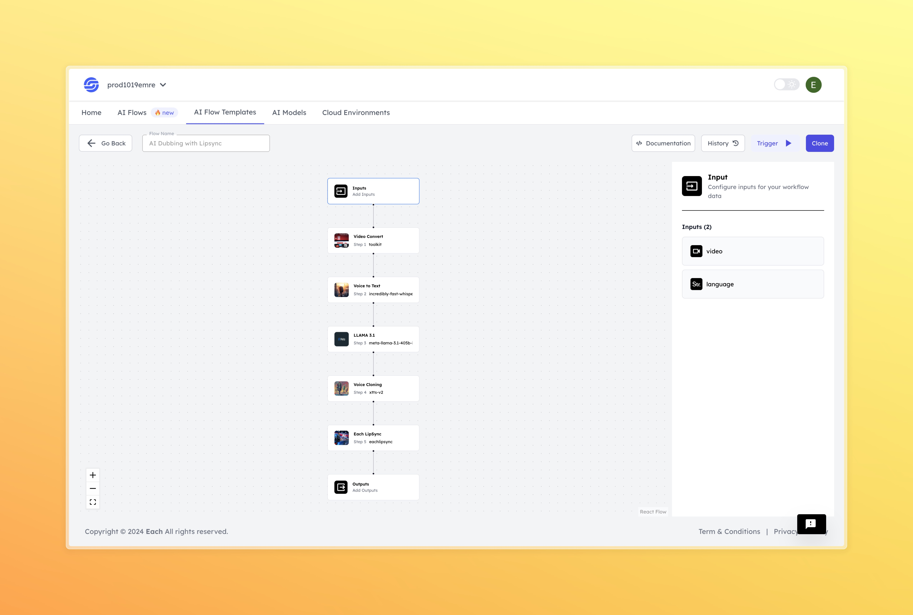

<!-- ABOUT THE PROJECT -->

# Ai Dubbing With Lipsync

    

## Overview

The AI Dubbing with Lipsync model is designed to automatically synchronize lip movements in a video with a target language audio track. Using advanced deep learning techniques, the model provides seamless and realistic dubbing, making it an excellent tool for multilingual video production, content localization, and entertainment.

## Features
- **Seamless Language Synchronization**
- **High-Quality Output**
- **Customizable Language Options**

## Use Cases
- Film and TV dubbing
- Content localization
- Educational content

# AI Flow Execution Inputs

This document provides explanations for the execution inputs used in your AI model.

## Inputs

### 1. `video`
- **Type:** String
- **Title:** Video
- **Component:** File

**Description:** This input represents a video file that the model will process. The file should contain the video that the model will analyze and synchronize with the audio. Supported file formats include `.mp4`

### 2. `language`
- **Type:** String
- **Title:** Language
- **Component:** Input

**Description:** This input specifies the target language for dubbing. The model will use this input to select the appropriate audio track and synchronize the lip movements accordingly. The language should be entered as a standard language code (e.g., `en` for English, `es` for Spanish).

**Language Available:** `en`,`es`,`fr`,`de`,`it`,`pt`,`pl`,`tr`,`ru`,`nl`,`cs`,`ar`,`zh`,`hu`,`ko`,`hi`

## Usage

These inputs are required parameters for running the model. Providing complete and accurate inputs ensures that the model operates correctly and yields expected results.

- **Video:** Upload the video file that you wish to dub.
- **Language:** Enter the desired language code for dubbing.

When these inputs are provided, the model will process the video and synchronize the audio in the target language to match the lip movements, delivering a natural and professional dubbed video.

                                                                                                                                                                           
## Examples

<!DOCTYPE html>
<html lang="en">
<head>
    <meta charset="UTF-8">
    <meta name="viewport" content="width=device-width, initial-scale=1.0">
    
</head>
<body>
    

        

            
Input

            

            

                <h3>Video</h3>
                <video controls volume="1.0">
                    <source src="https://storage.googleapis.com/magicpoint/github_inputs/gu%CC%88thub-input-ai-dubbing-with-lipsync.mp4" type="video/mp4">
                    Your browser does not support the video tag.
                </video>
                <a href="https://storage.googleapis.com/magicpoint/github_inputs/gu%CC%88thub-input-ai-dubbing-with-lipsync.mp4" target="_blank">
                    Video Input
                </a>
            

            

                <h3>Language</h3>
                
es

            

        

        

            
Output

            

            

                <h3>Video</h3>
                <video controls volume="1.0">
                    <source src="https://storage.googleapis.com/magicpoint/github-outputs/github-output-ai-dubbing-with-lipsync.mp4" type="video/mp4">
                    Your browser does not support the video tag.
                </video>
                <a href="https://storage.googleapis.com/magicpoint/github-outputs/github-output-ai-dubbing-with-lipsync.mp4" target="_blank">
                    Video Output
                </a>
            

        

    

</body>
</html>

