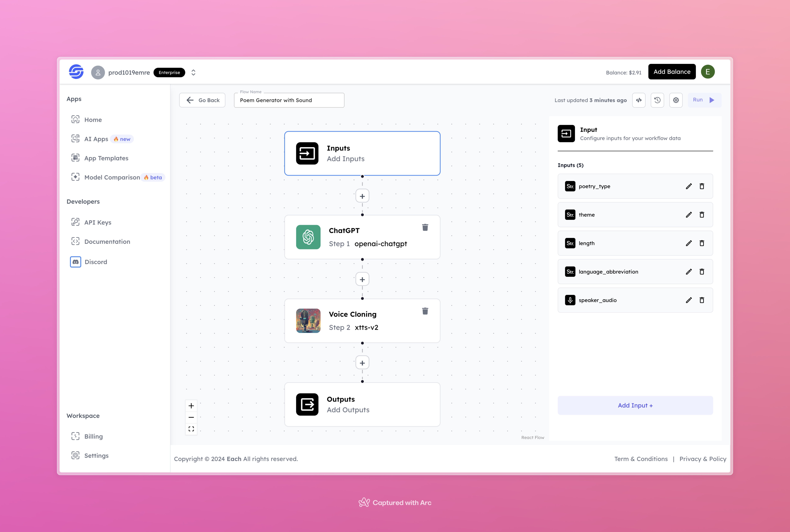

# AI Poem Generator Workflow with Sound

## Overview
AI Poem Generator Workflow with Sound: Generate poems using AI, add sound, and seamlessly integrate them into your application with Eachlabs API.

## Features
- **Poetry Generation**: Create poems based on style, theme, and length.
- **Voice Cloning**: Mimics the provided speaker audio.
- **Video Synchronization**: Produces videos with matching lip movements and audio.

## Inputs

### 1. poetry_type
- **Type:** String  
- **Description:** Specifies the type of poetry to generate (e.g., sonnet, free verse).

### 2. theme
- **Type:** String  
- **Description:** The main subject or theme of the poem (e.g., love, nature).

### 3. length
- **Type:** String  
- **Description:** Length of the poem (e.g., short, medium, long).

### 4. language_abbreviation
- **Type:** String  
- **Description:** Language of the poem in abbreviation format (e.g., "en" for English, "fr" for French).

### 5. speaker_audio
- **Type:** Audio File  
- **Description:** An audio file of the speaker's voice for cloning purposes.

## Example 

### Input
- **Poetry Type:** romantic  
- **Theme:** love  
- **Length:** 8 lines  
- **Language Abbreviation:** en  
- **Speaker Audio:** [Sample Audio](https://storage.googleapis.com/magicpoint/global_inputs/each-audio.mp3)

### Output
- **Generated Video:**  
[Output Audio](https://storage.googleapis.com/magicpoint/github-outputs/poem-generator-with-sound-github-output.wav)

## Conclusion
If you encounter an error, you can join our <b><a href="https://discord.com/invite/yzZD4ZxBPt" target="_blank">Discord</a></b> server.
