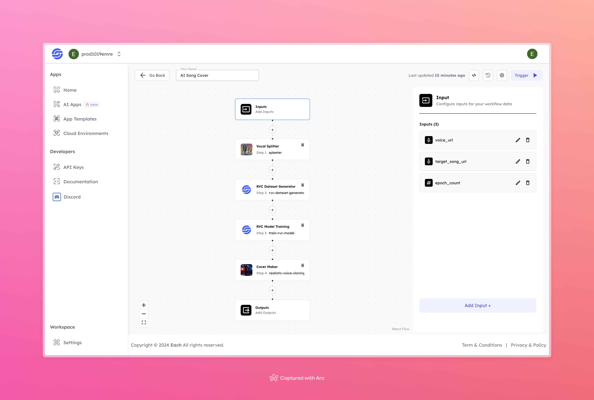

# AI Song Cover

## Overview

The AI Song Cover workflow automates the process of creating custom song covers by leveraging advanced vocal separation and model training techniques. Users provide an input voice and a target song, and the system generates a cover version of the target song using the input voice.

## Features
- **Vocal Separation**: Isolates vocals from the input audio using Spleeter.
- **Dataset Generation**: Automatically generates a training dataset from the isolated vocals.
- **Custom Model Training**: Trains a voice conversion model using the input voice and target song.
- **Cover Generation**: Creates a song cover using the trained model and the target song.

## Use Cases
- Create AI-generated song covers.
- Custom voice synthesis for music tracks.
- Personalized song covers for multimedia projects.

## Inputs

### 1. `voice_url`
- **Type:** String
- **Title:** Voice Audio URL
- **Component:** File

**Description:** URL of the voice audio file to be processed. Accepted formats include `.mp3`, `.wav`, etc.

### 2. `target_song_url`
- **Type:** String
- **Title:** Target Song Audio URL
- **Component:** File

**Description:** URL of the target song that will be used for the song cover. Accepted formats include `.mp3`, `.wav`, etc.

### 3. `epoch_count`
- **Type:** Integer
- **Title:** Epoch Count
- **Component:** Number

**Description:** The number of epochs for model training. Increasing the epoch count may improve the model’s performance, but also increases training time.

## Workflow

1. **Vocal Splitter (spleeter)**: Splits the voice from the audio provided via the `voice_url`.
2. **RVC Dataset Generator**: Generates a dataset from the isolated vocals.
3. **RVC Model Training**: Trains a custom RVC model using the dataset.
4. **Cover Maker (realistic-voice-cloning)**: Generates a song cover using the trained model and the `target_song_url`.

## Example

### Voice URL
[ Voice Input](https://storage.googleapis.com/magicpoint/global_inputs/best-motivational-speech-video-joe-rogan-motivation.mp3)

### Target Song URL
[Target Song](https://storage.googleapis.com/magicpoint/global_inputs/Eminem%20-%20Lose%20Yourself.mp3)

### Epoch Count
20

### Output
[Output](https://storage.googleapis.com/magicpoint/github-outputs/ai-song-cover-github-output.mp3)

## Conclusion

If you encounter an error, you can join our <b><a href="https://discord.com/invite/yzZD4ZxBPt" target="_blank">Discord</a></b> server.