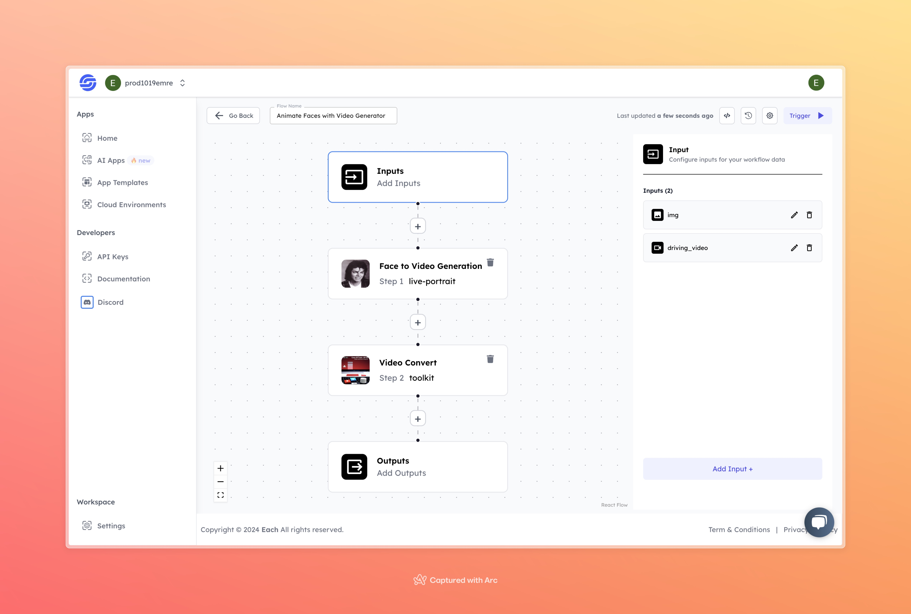

# Animate Faces with Video Generator

## Overview

The **Animate Faces with Video Generator** flow allows users to animate a face from a static image using a driving video. By mapping the facial expressions from the video onto the input image, the model generates an output where the still image appears animated in sync with the movements in the video. This tool is ideal for bringing static images to life, making it useful for various creative applications.

## Features
- **Facial Expression Animation**
- **Smooth Video Output**
- **Supports Various Input Formats**

## Use Cases
- Animate static photos for creative projects
- Generate lifelike movements from still images
- Enhance visual content for social media or personal use

## Inputs

### 1. `img`
- **Type:** Image file
- **Title:** Input Image
- **Component:** Input field

**Description:** The image file that will be animated based on the movements from the driving video. Supported formats include `.jpg`, `.png`, and other common image types.

### 2. `driving_video`
- **Type:** Video file
- **Title:** Driving Video
- **Component:** Input field

**Description:** A video file that contains the facial movements and expressions to be applied to the static image. Supported video formats include `.mp4`.

## Usage

To use the **Animate Faces with Video** tool, upload a static image as the `img` input and a driving video as the `driving_video`. The model will map the movements from the driving video onto the static image, resulting in an animated video output.

- **Input Image:** Upload the image you want to animate.
- **Driving Video:** Provide a video that contains the facial movements you want to transfer onto the image.

## Examples

### Input

**Image:**  

**Driving Video:**  
[Driving Video](https://storage.googleapis.com/magicpoint/inputs/photo-to-video-generation-input-video.mp4)

### Output

**Animated Video:**  
[Output Video](https://storage.googleapis.com/magicpoint/github-outputs/animate-face-with-video-github-output.gif)

## Conclusion

If you encounter an error, you can join our <b><a href="https://discord.com/invite/yzZD4ZxBPt" target="_blank">Discord</a></b> server.
