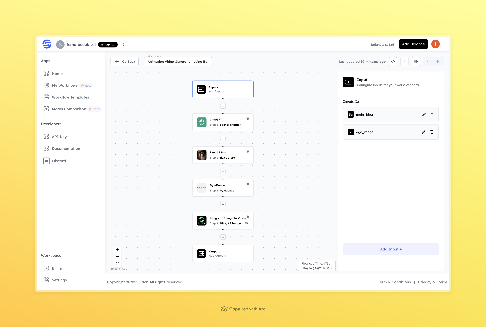

# Animation Video Generation Using ByteDance

## Overview
Create animated videos using ByteDance-powered workflows—easily integrate AI-driven animation into your web and mobile applications with Eachlabs API.

## Features
- **AI-Powered Video Generation**
- **Seamless Animation Processing**
- **Customizable Outputs**

## Use Cases
- Animated storytelling
- Marketing and promotional videos
- Social media content creation

## Inputs

### 1. `main_idea`
- **Type:** String
- **Title:** Main Idea
- **Component:** Input field

**Description:** This input represents the main concept or theme of the animation video. The model will generate an animation based on this idea.

### 2. `age_range`
- **Type:** String
- **Title:** Target Age Range
- **Component:** Input field

**Description:** This input specifies the target audience's age range for the animation video, allowing the model to tailor its style accordingly.

## Usage

These inputs are required parameters for running the model. Providing complete and accurate inputs ensures that the model operates correctly and yields expected results.

- **Main Idea**: Enter the core concept or storyline for the animation.
- **Target Age Range**: Specify the intended audience age group.

When these inputs are provided, the model will process them and generate an animated video accordingly.

## Examples

### Input
**Main Idea:** A child discovers a glowing butterfly in a dark forest, following it towards a mysterious light.  
**Target Age Range:** 6-10  

### Output
**Generated Animation:** [Click here to watch the animation](https://storage.googleapis.com/magicpoint/outputs/animation-video-generation-using-bytedance-readme-output.mp4)

## Conclusion

If you encounter an error, you can join our <b><a href="https://discord.com/invite/yzZD4ZxBPt" target="_blank">Discord</a></b> server.
