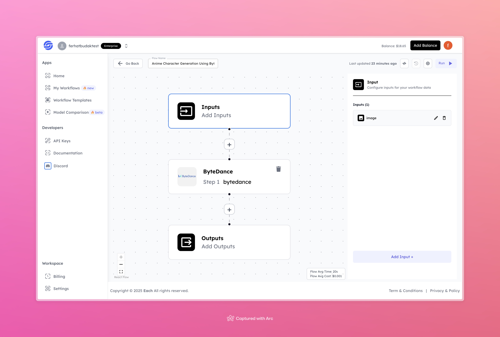

# Anime Character Generation Using ByteDance

## Overview
Effortlessly generate anime characters using ByteDance-powered workflows. Leverage the power of AI to transform your ideas into stunning anime-style visuals.

## Features
- **AI-Driven Anime Character Generation**
- **Seamless Image-to-Anime Conversion**
- **High-Quality Outputs**

## Use Cases
- Character design for games and stories
- Personalized anime avatars
- Visual content for social media or promotional materials

## Inputs

### 1. `image`
- **Type:** File (Image)
- **Title:** Input Image
- **Component:** File upload

**Description:** Upload an image that you want to convert into an anime-style character. The model processes the input image to generate a visually appealing anime version.

## Usage

These inputs are required parameters for running the model. Providing a clear and high-quality input image ensures the model operates effectively and produces the best results.

- **Input Image**: Upload the image you want to transform into an anime-style character.

Once the input is provided, the model will process it and generate the anime character accordingly.

## Examples

### Input
**Uploaded Image:** [Click here to view the input image](https://storage.googleapis.com/magicpoint/models/man.png)

### Output
**Generated Anime Character:** [Click here to view the output image](https://storage.googleapis.com/magicpoint/outputs/anime-character-gen-using-bytedance-readme-output.jpg)

## Conclusion
If you encounter an error or have questions, feel free to join our <b><a href="https://discord.com/invite/yzZD4ZxBPt" target="_blank">Discord</a></b> server for support.

