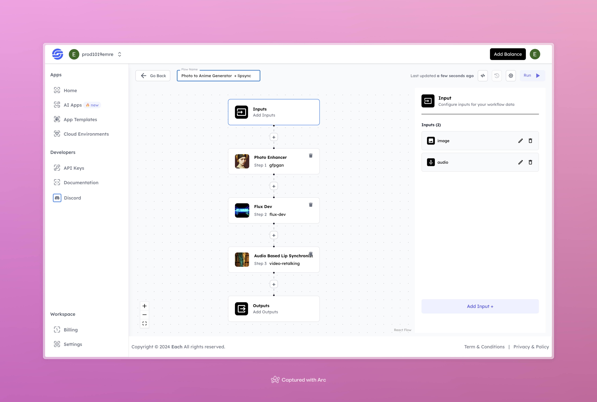

# Anime AI Image Generation Workflow from Photo with Lipsync

## Overview
Create Anime AI Images from Photos with Lipsync using Eachlabs workflows and Hailou AI—ideal for seamless integration into your web and mobile applications with Eachlabs API.

## Features

- **Image Enhancement**: Enhances the quality of the input image using advanced image restoration techniques.
- **Anime Style Generation**: Transforms the enhanced image into an anime-style character using the `flux-dev` model.
- **Lip Synchronization**: Matches the character's lip movements with the provided audio using the `video-retalking` model.
- **Customizable Inputs**: Accepts an image and an audio file for personalized video content.

## Use Cases

- Creating anime-style personalized videos
- Generating animated video content for social media
- Producing unique video messages with voice-over

## Inputs

### 1. `image`
- **Type**: Image File
- **Title**: Input Image
- **Component**: Input field

**Description**: Upload an image to be enhanced and converted into anime style. This image will serve as the basis for the anime character in the final video.

### 2. `audio`
- **Type**: Audio File
- **Title**: Input Audio
- **Component**: Input field

**Description**: Upload an audio file for lip synchronization. The anime character's lip movements will be synchronized with this audio in the final video.

## Example

### Input
- **Image**:

- **Audio**:

[Input Audio](https://storage.googleapis.com/magicpoint/global_inputs/each-audio.mp3)

### Output

[Output Video](https://storage.googleapis.com/magicpoint/github-outputs/photo-to-anime-hailuo-output.mp4)

## Conclusion

If you encounter an error, you can join our <b><a href="https://discord.com/invite/yzZD4ZxBPt" target="_blank">Discord</a></b> server.

