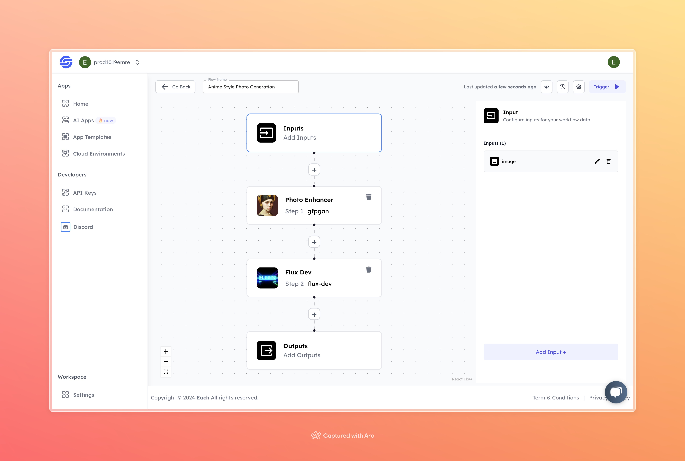

# Anime AI Image Generation Workflow

## Overview
Generate Anime AI Images using Eachlabs workflows—easily integrate anime-style image generation into your web and mobile applications with Eachlabs API.

## Features
- **Anime-Style Transformation**
- **Simple Interface**
- **High-Quality Anime Output**

## Use Cases
- Anime-inspired artwork creation
- Content generation for social media
- Personal projects and creative purposes

## Inputs

### 1. `image`
- **Type:** Image file
- **Title:** Input Image
- **Component:** Input field

**Description:** The input field requires an image file that will be transformed into an anime-style visual. Supported formats include `.jpg`, `.png`, and other common image types.

## Usage

Simply upload an image and the model will process it through the steps outlined above to generate an anime-style output. Providing a high-quality input image will yield the best results.

- **Input Image:** Upload the image that you want to transform into an anime-style visual.

## Examples

### Input

### Output

## Conclusion

If you encounter an error, you can join our <b><a href="https://discord.com/invite/yzZD4ZxBPt" target="_blank">Discord</a></b> server.
