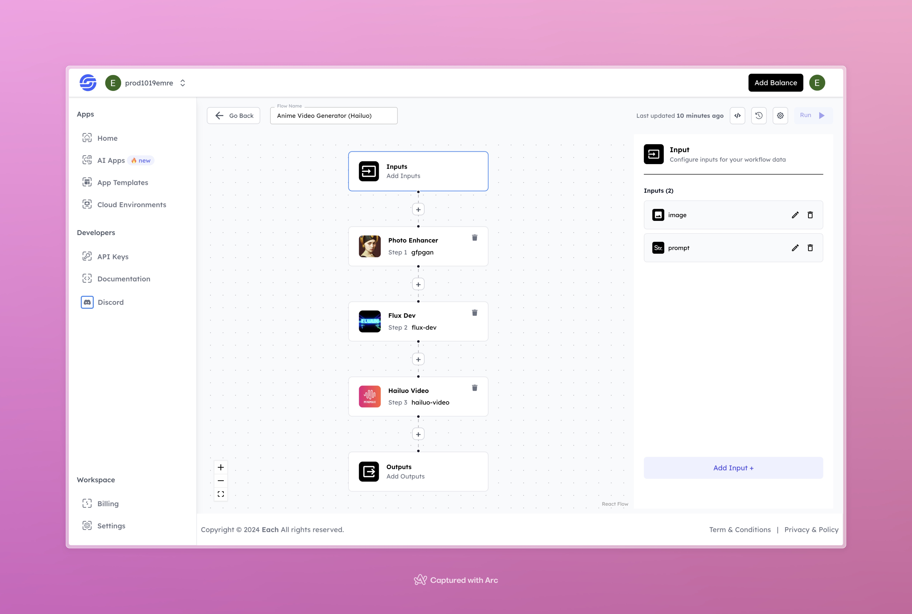

# Anime Video Generator with Hailuo

## Overview
The Anime Video Generator with Hailuo is a tool that allows you to create anime-style videos based on character prompts and images. By simply providing an image and a story prompt, the tool enhances the image, generates the character, and produces a short anime video.

## Features
- **Image Enhancement** with GFPGAN
- **AI-Based Character Generation** using Flux Dev
- **Automated Anime Video Creation** using Hailuo Video

## Use Cases
- Anime-style video creation for personal or commercial projects
- Personalized anime character videos
- Creative storytelling through short anime clips

## Inputs

### 1. `image`
- **Type:** File (Image)
- **Title:** Character Image
- **Component:** Image Upload

**Description:** Upload an image that serves as the base for the anime character to be enhanced and animated.

### 2. `prompt`
- **Type:** String
- **Title:** Story Prompt
- **Component:** Input field

**Description:** A short description or story idea to guide the character's narrative in the anime video.

## Example 

### Input
- **Image:** 

- **Prompt:** a dancing woman
### Output
- **Video:** 
[Output Video](https://storage.googleapis.com/magicpoint/github-outputs/anime-video-generator-hailuo-github-output.mp4)
## Conclusion

For any issues or feedback, please join our <b><a href="https://discord.com/invite/yzZD4ZxBPt" target="_blank">Discord</a></b> server to get help from the community.
