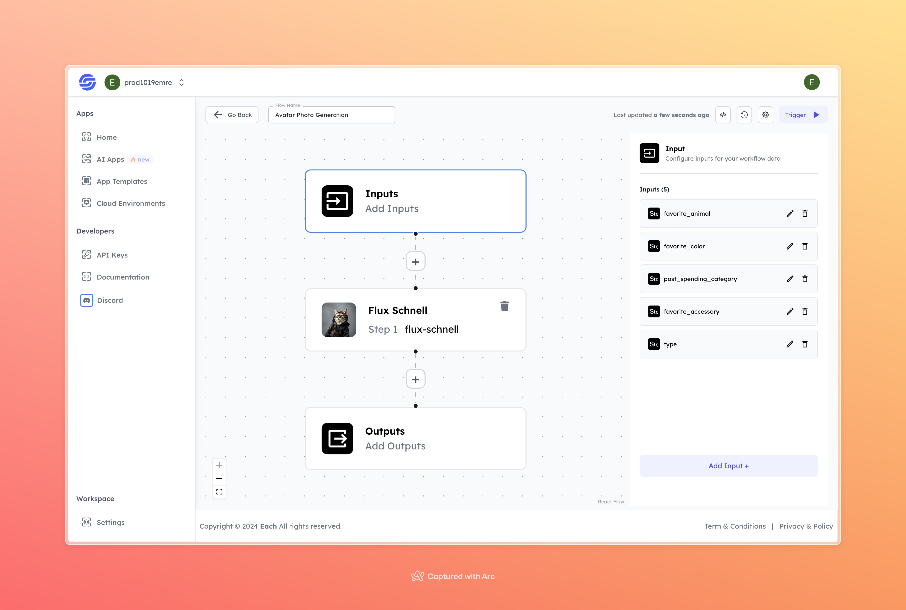

# Avatar Photo Generation

## Overview
The Avatar Photo Generation AI makes it easy to create custom avatars based on user choices. By using details like favorite animal, color, and accessories, the model creates a unique avatar. It's a simple tool for anyone looking to quickly make personalized avatars.

## Features
- **Customizable Inputs**
- **AI-Generated Avatars**
- **User-Friendly Interface**

## Use Cases
- Personal avatars for social media
- Gaming avatars
- Marketing and branding purposes

## Inputs

### 1. `favorite_animal`
- **Type:** String
- **Title:** Favorite Animal
- **Component:** Input field

**Description:** Specifies the user's favorite animal to be used as the base for the avatar.

### 2. `favorite_color`
- **Type:** String
- **Title:** Favorite Color
- **Component:** Input field

**Description:** Defines the user's preferred color to be applied to the avatar’s design.

### 3. `past_spending_category`
- **Type:** String
- **Title:** Past Spending Category
- **Component:** Input field

**Description:** Represents a category that influences avatar design based on past spending behavior.

### 4. `favorite_accessory`
- **Type:** String
- **Title:** Favorite Accessory
- **Component:** Input field

**Description:** Allows users to add a favorite accessory, such as a hat or glasses, to the avatar.

### 5. `type`
- **Type:** String
- **Title:** Avatar Type
- **Component:** Input field

**Description:** Specifies the type of avatar, whether it’s realistic, cartoonish, or stylized.

## Usage

Provide the necessary inputs to the model to generate a personalized avatar based on user preferences. The model uses the following inputs:

- **Favorite Animal**: Choose the base animal for your avatar.
- **Favorite Color**: Select a primary color for your avatar.
- **Past Spending Category**: Add personality traits based on spending behavior.
- **Favorite Accessory**: Pick an accessory to style your avatar.
- **Avatar Type**: Choose the style of the avatar.

## Examples

### Input
- **favorite_animal:** panda
- **favorite_color:** purple
- **past_spending_category:** Travel
- **favorite_accessory:** wrist watch
- **type:** superhero

### Output

## Conclusion

If you encounter an error, you can join our <b><a href="https://discord.com/invite/yzZD4ZxBPt" target="_blank">Discord</a></b> server.