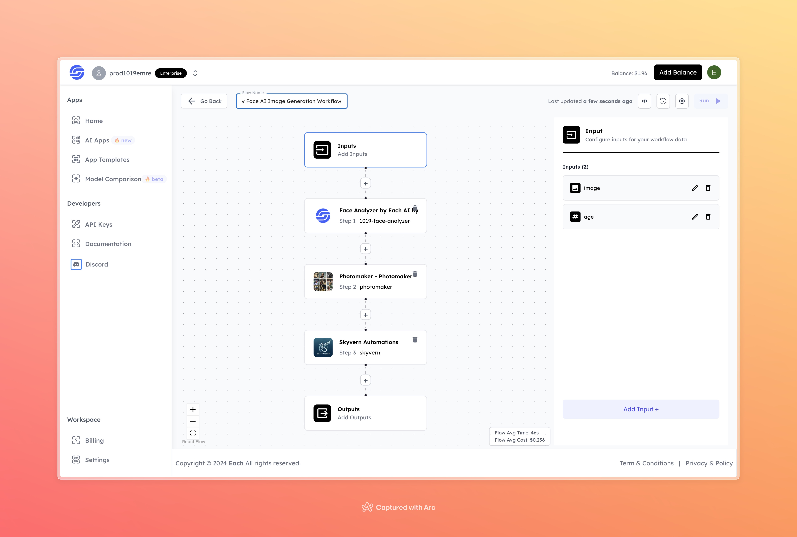

# AI Baby Face AI Image Generation Workflow

## Overview

Create AI Baby Face Images with Eachlabs workflows—seamlessly integrate baby face image generation into your web and mobile applications with Eachlabs API.
---

## Features

- **Face Analyzer**: Analyzes facial features to prepare for age transformation.  
- **Photomaker**: Enhances and refines the output images for realism and detail.  

---

## Inputs

### 1. `image`  
- **Type:** File  
- **Title:** Input Image  
- **Component:** Image Upload  

**Description:** Upload an image of the individual to transform into a baby-faced version.

### 2. `age`  
- **Type:** Number  
- **Title:** Desired Age  
- **Component:** Age Selector  

**Description:** Enter the desired target age for facial transformation (e.g., 5 years old).

---

## Example Input and Output

### Input  

  

### Age: 5

### Output  

  

---

## Conclusion

If you encounter an error, you can join our <b><a href="https://discord.com/invite/yzZD4ZxBPt" target="_blank">Discord</a></b> server.
