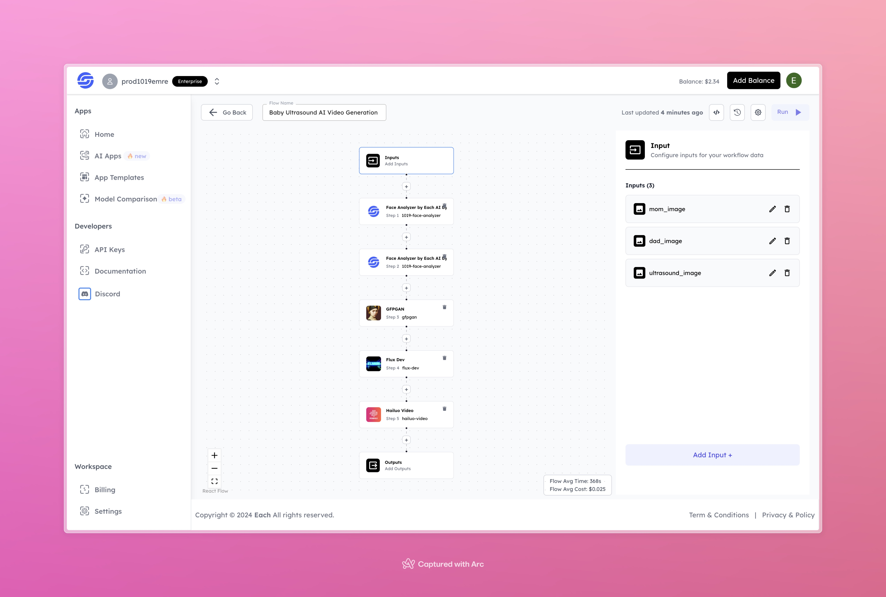

# Baby Ultrasound AI Video Generation Workflow with Hailuo AI

## Overview
Create Baby Ultrasound videos using Hailuo AI and our Eachlabs workflow for easy integration into your web and mobile applications with Eachlabs API.

## Features
- **Face Analysis** to analyze and enhance parental images.
- **Image Restoration** with GFPGAN for higher quality outputs.
- **AI Video Creation** with Hailuo to animate ultrasound images dynamically.

## Inputs

### 1. `mom_image`
- **Type:** File
- **Title:** Mom Image
- **Component:** Image Upload

**Description:** Upload an image of the mother. This input will be processed and analyzed to enhance facial details for the final output.

### 2. `dad_image`
- **Type:** File 
- **Title:** Dad Image
- **Component:** Image Upload

**Description:** Upload an image of the father. This input will also be analyzed to contribute to the generation of the output.

### 3. `ultrasound_image`
- **Type:** File
- **Title:** Ultrasound Image
- **Component:** Image Upload

**Description:** Upload an ultrasound scan of the baby. The system will animate and enhance this image to generate the final video output.

---

## Workflow Steps

1. **Face Analyzer by Each AI**  
   Processes and analyzes parental images (`mom_image` and `dad_image`) for accurate facial features.

2. **GFPGAN**  
   Restores and enhances the quality of the provided parental images.

3. **Flux Dev**  
   Processes the ultrasound image to ensure seamless integration for animation.

4. **Hailuo Video**  
   Converts the processed ultrasound scan into a dynamic video output.

---

## Example Input and Output

### Input
- **Mom Image:**  

- **Dad Image:**  

- **Ultrasound Image:**  

### Output

- **Video Output:**  
[Output Video](https://storage.googleapis.com/magicpoint/github-outputs/baby-ultrasound-ai-video-generation-workflow-with-hailuo-ai-output.mp4)

---

## Conclusion

If you encounter an error, you can join our <b><a href="https://discord.com/invite/yzZD4ZxBPt" target="_blank">Discord</a></b> server.
