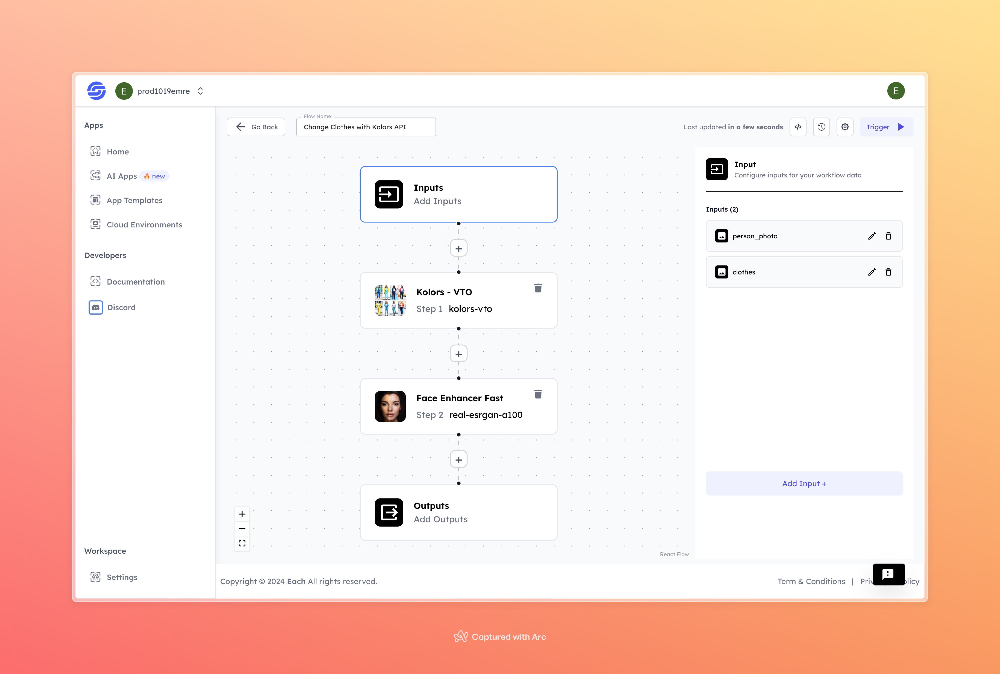

# Change Clothes with Kolors API

## Overview

The Change Clothes with Kolors API allows users to virtually try on different outfits using AI techniques. By uploading a photo, the API analyzes the user's body and facial features to accurately replace clothing in the image. It generates a hyper-realistic representation of the new outfit on the user, facilitating style exploration and fashion experimentation. This tool streamlines the process of trying on clothes without physical fitting, providing an efficient way to visualize different looks.

## Features
- **High-Quality Clothing Replacement**: Generate realistic images with new clothes applied seamlessly.
- **AI-Powered Personalization**: The model identifies body shape, face, and posture to ensure natural fit and look.
- **Easy-to-Use Workflow**: Just upload a photo of a person and the clothes image to see the transformation instantly.

## Use Cases
- **Fashion Visualization**: Preview how different clothes look on you without having to try them on.
- **Marketing**: Create promotional materials showcasing different outfits on models.
- **Personal Projects**: Have fun swapping outfits in photos for creative, personal use.

## Inputs

### 1. `person_photo`
- **Type:** File (Image)
- **Title:** Person's Photo
- **Component:** Input field

**Description:** Upload a high-quality image of the person whose clothes you want to change. This image will be analyzed by the AI model to apply new clothes in a realistic way. Supported file formats: `.jpg`, `.png`, etc.

### 2. `clothes`
- **Type:** File (Image)
- **Title:** Clothes Image
- **Component:** Input field

**Description:** Upload an image of the clothes you want to apply to the person. The model will fit the clothes onto the person’s body based on size, shape, and posture. Supported file formats: `.jpg`, `.png`, etc.

## Usage

To use the **Change Clothes with Kolors API Flow**, you need to upload both a photo of the person and an image of the clothes you wish to apply. Once both inputs are provided, the model processes the images and returns a realistic result with the new clothes applied.

- **Person's Photo**: Upload the image of the person.
- **Clothes Image**: Upload the image of the clothes you want to see applied.

When these inputs are given, the AI will analyze both the person's image and the clothes image to deliver a visually realistic result where the person appears to be wearing the new outfit.

## Examples

### Input 1: Person Photo

### Input 2: Clothes Image

### Output

## Conclusion

If you encounter an error, you can join our <b><a href="https://discord.com/invite/yzZD4ZxBPt" target="_blank">Discord</a></b> server.
