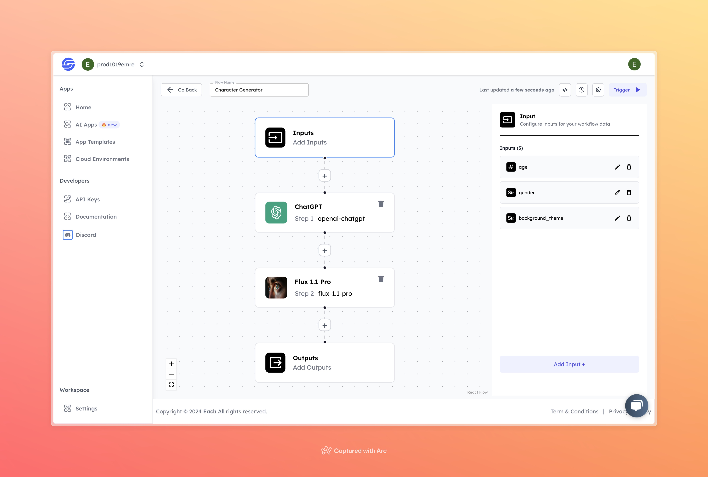

# Character Photo Generation with FLUX1.1[pro]

## Overview
The Character Generator AI lets users quickly create custom characters based on simple inputs like age, gender, and background theme. It's a useful tool for game developers, writers, and creatives who need character designs fast, without needing drawing skills. This tool helps generate diverse character concepts for various projects easily.

## Features
- **Customizable Character Attributes**
- **User-Friendly Interface**
- **Rapid Character Creation**

## Use Cases
- Video game character design
- Creative writing and storytelling
- Animation and illustration projects

## Inputs

### 1. `age`
- **Type:** Integer
- **Title:** Character Age
- **Component:** Input field

**Description:** This input specifies the age of the character being created. The model will use this information to generate a character that visually represents the desired age group.

### 2. `gender`
- **Type:** String
- **Title:** Character Gender
- **Component:** Input field

**Description:** This input defines the gender of the character. Users can specify their preferences, and the model will generate a character that matches the indicated gender.

### 3. `background_theme`
- **Type:** String
- **Title:** Background Theme
- **Component:** Input field

**Description:** This input allows users to choose a theme for the character's background. The selected theme will influence the overall design and atmosphere of the character.

## Usage

These inputs are crucial for running the model. Providing complete and accurate inputs will ensure the model operates effectively and yields the desired character design.

- **Character Age:** Specify the age of the character you wish to create.
- **Character Gender:** Enter the gender preference for your character.
- **Background Theme:** Select a theme for the character’s environment.

When these inputs are provided, the model will generate a unique character design based on the specified age, gender, and background theme.

## Examples

### Input
- **age:** 25
- **gender:** Female
- **background_theme:** Futuristic cityscape

### Output

## Conclusion

If you encounter any issues, feel free to join our <b><a href="https://discord.com/invite/yzZD4ZxBPt" target="_blank">Discord</a></b> server for support.
