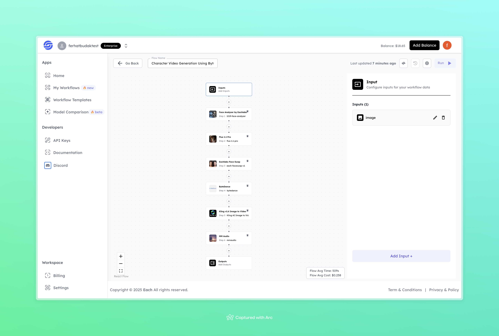

# Character Video Generation Using ByteDance

## Overview
Create realistic character-driven videos using ByteDance-powered workflows—effortlessly integrate AI-based video generation into your projects with cutting-edge tools like Flux 1.1 Pro and Eachlabs Face Swap.

## Features
- **AI-Driven Character Animation**
- **Seamless Face Swapping and Analysis**
- **High-Quality Audio Integration**

## Use Cases
- Character-based storytelling
- Video production for marketing
- Personalized video messages

## Inputs

### 1. `image`
- **Type:** File (Image)
- **Title:** Character Image
- **Component:** File uploader

**Description:** This input represents the image of the character to be used in the video. The system will analyze and process this image for video generation.

## Usage
These inputs are required parameters for running the model. Providing a clear, high-quality image ensures optimal results.

## Examples

### Input
- **Image**: [Click here to image](https://storage.googleapis.com/magicpoint/models/women.png)

### Output
**Generated Video:** [Click here to watch the video](https://storage.googleapis.com/magicpoint/outputs/character-video-generation-using-bytedance-readme-output.mp4)

## Conclusion

If you encounter an error, you can join our <b><a href="https://discord.com/invite/yzZD4ZxBPt" target="_blank">Discord</a></b> server.
