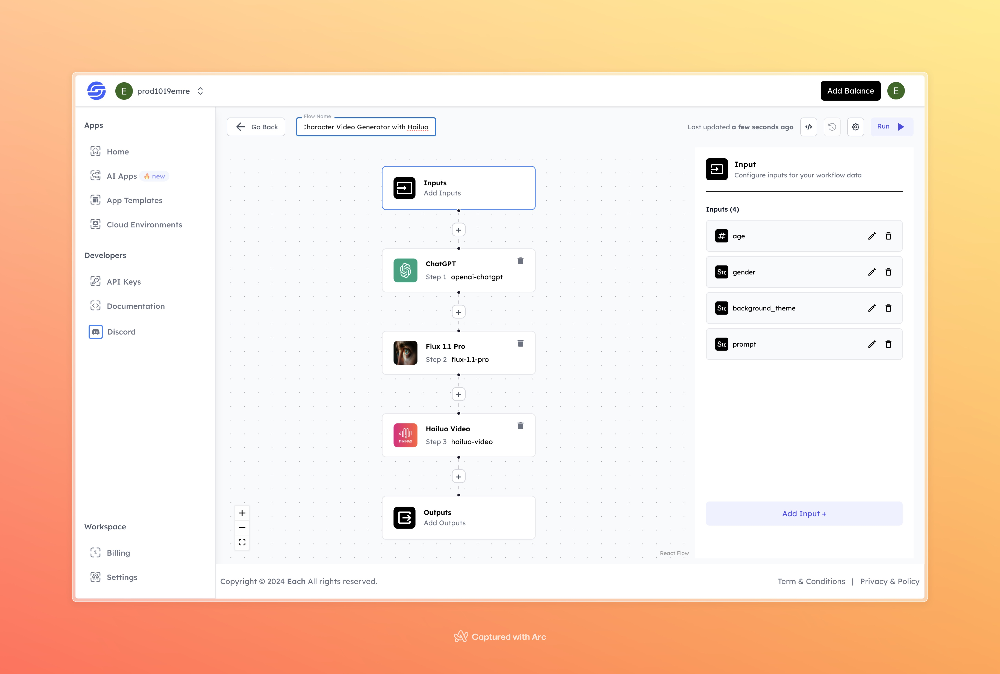

# Character Video Generator with Hailuo

## Overview
The Character Video Generator with Hailuo is a simple tool that helps you create character-based videos. You just need to provide details like the character's age, gender, background, and a short story idea. The tool then turns these inputs into an animated video, perfect for bringing your character stories to life quickly and easily.

## Features
- **Character Customization** based on age, gender, and background theme
- **AI-Powered Story Generation** using ChatGPT
- **Automated Character Rendering** with Flux 1.1 Pro
- **Short Video Creation** using Hailuo AI

## Use Cases
- Character-based story creation
- Short animated videos for creative projects
- Personalized video content for social media

## Inputs

### 1. `age`
- **Type:** Integer
- **Title:** Character Age
- **Component:** Input field

**Description:** Specifies the age of the character to be generated.

### 2. `gender`
- **Type:** String
- **Title:** Character Gender
- **Component:** Input field

**Description:** Defines the gender of the character to be created. Options can include "male", "female", or "non-binary".

### 3. `background_theme`
- **Type:** String
- **Title:** Background Theme
- **Component:** Input field

**Description:** Determines the background setting for the character's environment. This could be something like "fantasy", "space", or "urban".

### 4. `prompt`
- **Type:** String
- **Title:** Story Prompt
- **Component:** Input field

**Description:** A short description or story idea that serves as the basis for generating the character's narrative and dialogue in the video.

## Usage

1. Provide the required inputs such as the character's age, gender, background theme, and a story prompt.
2. The AI will generate a personalized story using ChatGPT.
3. Flux 1.1 Pro will render a character based on the inputs provided.
4. Hailuo Video will create a short animated video featuring the character and story.

## Example Input and Output

### Input
- **Age:** 30
- **Gender:** male
- **Background Theme:** forest
- **Prompt:** a talking

### Output

[Output Video](https://storage.googleapis.com/magicpoint/github-outputs/character-video-generator-with-hailuo.mp4)

## Conclusion

If you encounter an error, you can join our <b><a href="https://discord.com/invite/yzZD4ZxBPt" target="_blank">Discord</a></b> server.