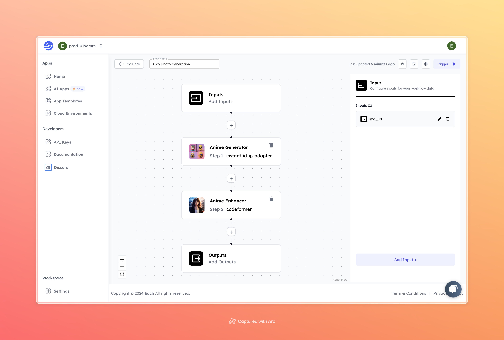

# Clay Style AI Image Generation Workflow

## Overview
Create Clay Style AI Images using Eachlabs workflows—seamlessly integrate clay-inspired visuals into your web and mobile applications with Eachlabs API.

## Features
- **Clay-like Visual Transformation**
- **Easy-to-Use Interface**
- **High-Quality Output**

## Use Cases
- Artistic and creative content generation
- Social media and promotional posts
- Personalized image transformations for fun or artistic purposes

## Inputs

### 1. `img_url`
- **Type:** String (URL)
- **Title:** Image URL
- **Component:** Input field

**Description:** This input requires the URL of the image that will be transformed into a clay-like visual. Supported formats include `.jpg`, `.png`, and other common image types.

## Usage

These inputs are crucial for running the model effectively. Providing an accurate image URL will ensure that the AI can process and transform the image into the desired clay style.

- **Image URL:** Paste the URL of the image you want to transform into a clay visual.

When the input is provided, the model will pass the image through two stages to generate a stylized output.

## Examples

### Input

 

### Output

## Conclusion

If you encounter any issues or need further assistance, feel free to join our <b><a href="https://discord.com/invite/yzZD4ZxBPt" target="_blank">Discord</a></b> server for support.
