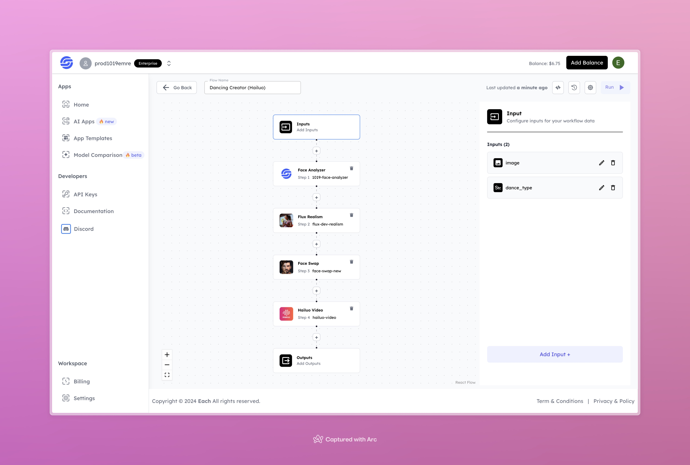

# Dance AI Video Generation with Hailuo AI 

## Overview
Create and customize AI dance videos using Hailuo AI and our Eachlabs workflow for easy integration into your web and mobile applications with Eachlabs API.

## Use Cases
- Fun personal dance videos.
- Creative social media content.
- Personalized gifts.

## Features
- **Face Analysis**: Extracts and prepares the uploaded image for integration into the flow.
- **Realistic Enhancement**: Enhances the realism of the provided image for better results.
- **Face Swap**: Merges the user's face with a pre-defined dancer.
- **Video Generation**: Outputs a high-quality dance video matching the selected style.

## Inputs

### 1. `image`
- **Type:** File
- **Title:** Image
- **Component:** Image Upload

**Description:** Upload a clear photo of yourself to personalize the dance video.

### 2. `dance_type`
- **Type:** Text
- **Title:** Dance Type
- **Component:** Dropdown

**Description:** Select a dance style (e.g., hip-hop, salsa, ballet) to set the theme of the video.

## Example

### Input
- **Image**: 

  
- **Dance Type:** Hip-Hop

### Output
- **Dance Video**: 
[Watch Dance Video](https://storage.googleapis.com/magicpoint/github-outputs/dancing-creator-github-output.mp4)

## Conclusion
If you encounter an error, you can join our <b><a href="https://discord.com/invite/yzZD4ZxBPt" target="_blank">Discord</a></b> server.
