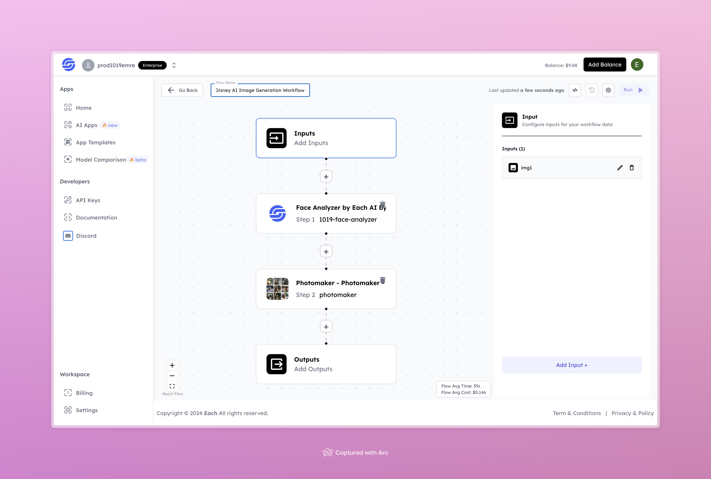

# Disney AI Image Generation Workflow

## Overview

Generate Disney-Style AI Images using Eachlabs workflows—seamlessly integrate custom Disney-inspired visuals into your web and mobile applications with Eachlabs API.

---

## Features

- **Face Analyzer by Each AI**: Analyzes and prepares the input face for Disney-style transformation.  
- **Photomaker**: Enhances and stylizes the input image for a Disney-like output.  

---

## Inputs

### 1. `img1`  
- **Type:** File  
- **Title:** Input Image  
- **Component:** Image Upload  

**Description:** Upload the image of the individual to generate a Disney-style transformation.

---

## Steps

1. **Face Analyzer by Each AI**  
   - **Step Name:** `1019-face-analyzer`  
   - **Functionality:** Analyzes the input image to identify and process facial features.

2. **Photomaker - Photomaker**  
   - **Step Name:** `photomaker`  
   - **Functionality:** Generates and enhances the Disney-like image output.

---

## Outputs

- **Type:** Image  
- **Description:** Disney-style image generated from the input.  

---

## Example Input and Output

### Input  
  

---

### Output  
  

---

## Conclusion

If you encounter an error, you can join our <b><a href="https://discord.com/invite/yzZD4ZxBPt" target="_blank">Discord</a></b> server.
