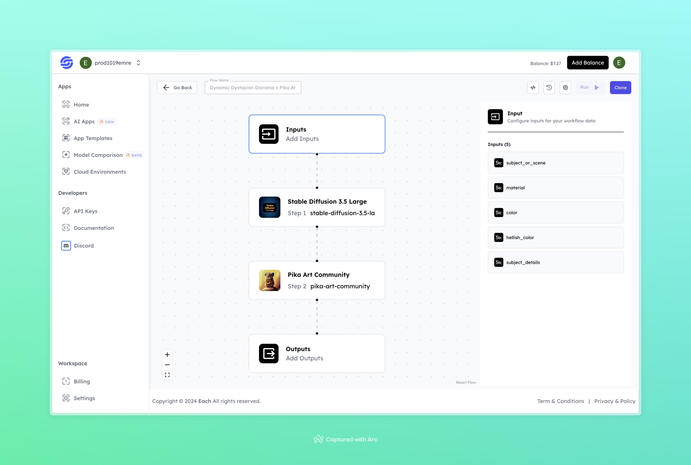

# Dynamic Dystopian Diorama + Pika Art

## Overview
The Dynamic Dystopian Diorama + Pika Art flow uses both Stable Diffusion 3.5 and Pika Art Community models to create detailed dystopian scenes. With Stable Diffusion’s high-quality visuals and Pika Art’s unique style, you can generate immersive, customizable diorama-style images with a distinctive look.

## Features
- **Detailed Dystopian Visuals**: Generates high-quality, dystopian-inspired scenes with deep customization.
- **Unique Art Style**: Adds an artistic flair with Pika Art Community, enhancing the final image’s uniqueness.
- **Customizable Input Parameters**: Allows users to specify scene elements, colors, and textures for personalized visuals.

## Use Cases
- Concept art for dystopian-themed projects
- Visual content creation for storytelling
- Unique diorama-style artwork generation

## Inputs

### 1. `subject_or_scene`
- **Type:** String
- **Description:** Define the primary subject or scene, such as "abandoned city" or "futuristic wasteland."

### 2. `material`
- **Type:** String
- **Description:** Specify the material or texture, e.g., "rusted steel" or "concrete."

### 3. `color`
- **Type:** String
- **Description:** Choose the main color tone for the scene, such as "gray" or "dark green."

### 4. `hellish_color`
- **Type:** String
- **Description:** Add an additional intense color to enhance the dystopian effect, like "fiery red."

### 5. `subject_details`
- **Type:** String
- **Description:** Include extra details about the subject to personalize the scene, e.g., "overgrown with vines" or "covered in ash."

## Usage

Configure the following input parameters to customize your dystopian diorama:

- **Subject or Scene**: Describe the main subject of your scene.
- **Material**: Select the material to shape the scene’s texture.
- **Color**: Choose a primary color tone.
- **Hellish Color**: Add a secondary, intense color for a dramatic touch.
- **Subject Details**: Provide extra details for a more customized visual.

Once configured, this flow generates a detailed and uniquely styled dystopian image.

## Examples

### Input

- **Subject or Scene**: post-apocalyptic cityscape
- **Material**: darkened steel
- **Color**: blood red
- **Hellish Color**: deep crimson
- **Subject Details**: collapsed buildings covered in moss and vines, remnants of neon signs flickering weakly

### Output

[Output Video](https://storage.googleapis.com/magicpoint/github-outputs/dynamic-dystopian-diorama-pika-github-output.mp4)

## Conclusion

If you encounter an error, you can join our <b><a href="https://discord.com/invite/yzZD4ZxBPt" target="_blank">Discord</a></b> server.
