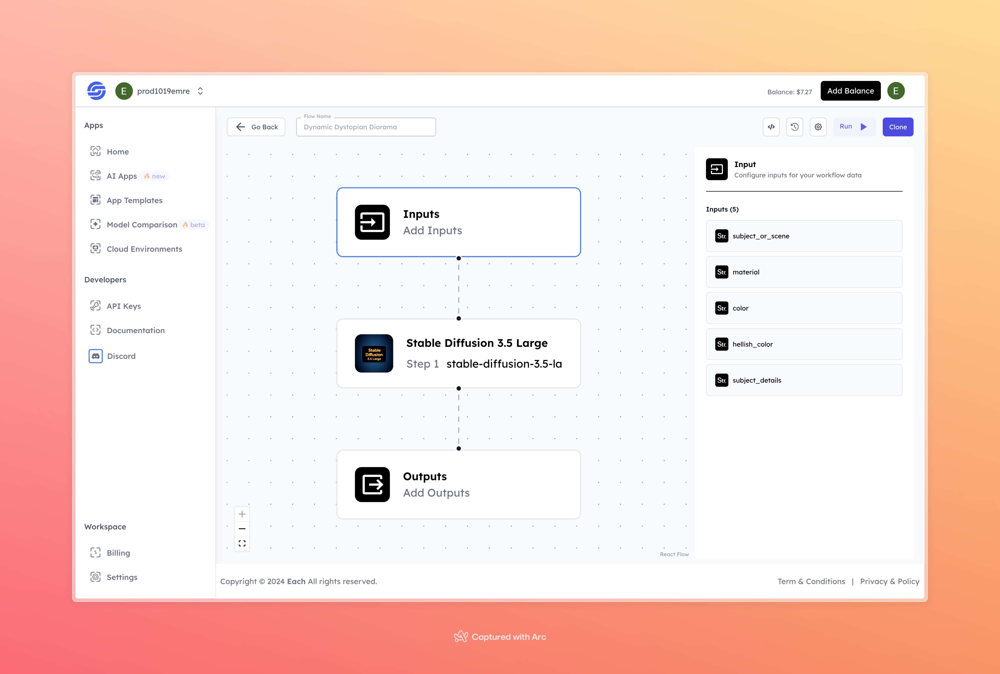

# Dynamic Dystopian Diorama

## Overview
Dynamic Dystopian Diorama flow lets users create detailed dystopian scenes with the Stable Diffusion 3.5 model. You can customize the subject, materials, colors, and details to get a vivid dystopian look. Ideal for making unique, diorama-style visuals

## Features
- **Customizable Scene Elements**: Adjust scene subject, materials, and colors.
- **High-Quality Dystopian Visuals**: Achieve realistic dystopian settings.
- **Flexible Design Options**: Experiment with various input combinations.

## Use Cases
- Concept art for dystopian environments
- Visual content creation for storytelling
- Unique, AI-generated dystopian artwork

## Inputs

### 1. `subject_or_scene`
- **Type:** String
- **Description:** Specify the main subject or scene to be depicted, such as "abandoned city" or "futuristic wasteland."

### 2. `material`
- **Type:** String
- **Description:** Define the primary material or texture for the scene, such as "metal," "concrete," or "rusted steel."

### 3. `color`
- **Type:** String
- **Description:** Choose the primary color tone for the scene, allowing for mood-specific adjustments like "gray" or "dark green."

### 4. `hellish_color`
- **Type:** String
- **Description:** Specify an additional color for a more intense, hellish effect, enhancing the dystopian atmosphere, e.g., "fiery red."

### 5. `subject_details`
- **Type:** String
- **Description:** Add extra details about the subject for more personalization, such as "overgrown with vines" or "covered in ash."

## Usage

To use this flow, configure the input parameters based on your desired dystopian theme:

- **Subject or Scene:** Describe the primary subject of the dystopian scene.
- **Material:** Choose a material to define the environment’s texture.
- **Color:** Select a primary color tone.
- **Hellish Color:** Add a secondary color for dramatic effect.
- **Subject Details:** Provide additional details to enhance the subject’s appearance.

Once configured, the flow will generate a detailed dystopian diorama image based on these inputs.

## Examples

### Input

- **Subject or Scene:** post-apocalyptic cityscape
- **Material:** darkened steel
- **Color:** blood red
- **Hellish Color:** deep crimson
- **Subject Details:** collapsed buildings covered in moss and vines, remnants of neon signs flickering weakly

### Output

## Conclusion

If you encounter an error, you can join our <b><a href="https://discord.com/invite/yzZD4ZxBPt" target="_blank">Discord</a></b> server.
