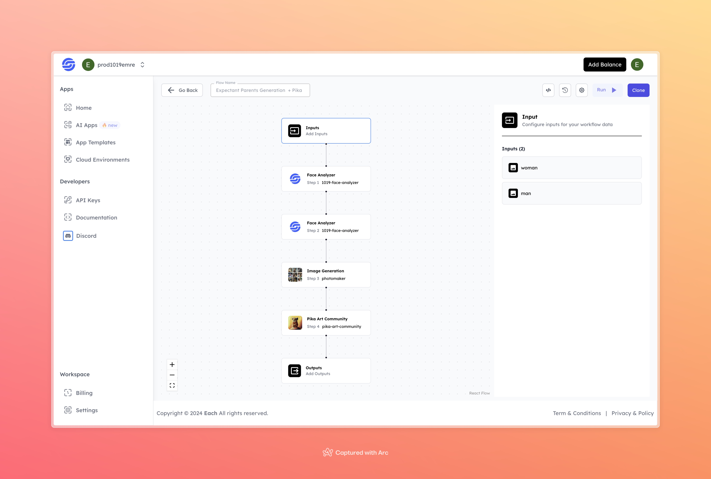

# Expectant Parents Generation + Pika Effect

## Overview
The Expectant Parents Generation tool helps create images and videos that combine features from two parent images, giving an idea of a potential future child's appearance. This tool uses face analysis and image generation models to produce realistic images based on the provided photos. Additionally, it applies the Pika effect to generate a stylized video of the generated image, bringing the output to life.

## Features
- **Face Analysis** using 1019-Face-Analyzer (for both parent images)
- **Image Generation** with Photomaker
- **Community-Based Enhancements** using Pika Art Community

## Use Cases
- Creating speculative images of future children
- Visualizing family characteristics in potential offspring
- Entertainment purposes for expectant parents or curious individuals

## Inputs

### 1. woman
- **Type:** File 
- **Title:** Woman
- **Component:** Image Upload

**Description:** Upload an image of the woman to be used in the generation process.

### 2. man
- **Type:** File 
- **Title:** Man
- **Component:** Image Upload

**Description:** Upload an image of the man to be used in the generation process.

## Example 

### Input
- **Woman:** 

- **Man:** 

### Output
[Output Video](https://storage.googleapis.com/magicpoint/github-outputs/expectant-parents-generator-github-output.mp4)

## Conclusion

For any issues or feedback, please join our <b><a href="https://discord.com/invite/yzZD4ZxBPt" target="_blank">Discord</a></b> server to get help from the community.
