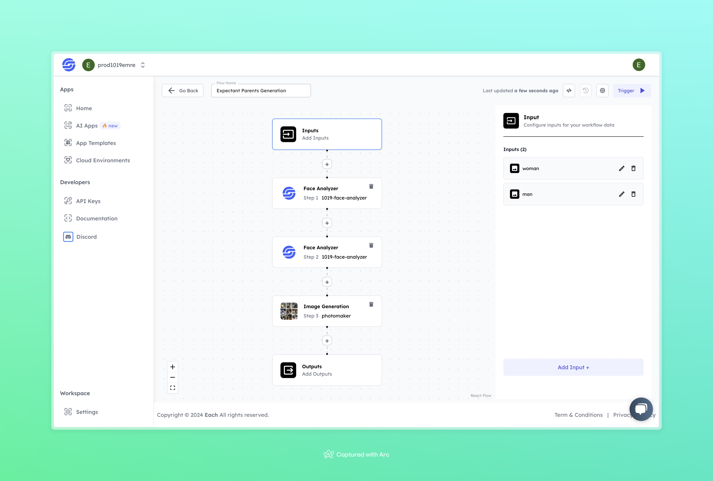

# Expectant Parent Photo Generation

## Overview
The Expectant Parents Photo Generation tool takes an image of a man and a woman and generates realistic images of them as expectant parents. Using facial analysis, the model applies features from the provided images to create photos of the man and woman as if they were in a pregnancy phase. This tool provides a creative and engaging way to visualize individuals as expectant parents.

## Features
- **Facial Feature Analysis**
- **Realistic Expectant Parent Image Generation**
- **Simple and Fun Interaction**

## Use Cases
- Entertainment
- Visualizing Expectant Parents
- Personal Curiosity

## Inputs

### 1. `woman`
- **Type:** Image
- **Title:** Woman's Face Image
- **Component:** File

**Description:** Upload an image of the woman's face. The model will use this image to generate a picture of the woman as an expectant mother. Supported file formats: `.jpg`, `.png`.

### 2. `man`
- **Type:** Image
- **Title:** Man's Face Image
- **Component:** File

**Description:** Upload an image of the man's face. The model will use this image to generate a picture of the man as an expectant father. Supported file formats: `.jpg`, `.png`.

## Usage

To use this model:
1. Upload the woman's face image.
2. Upload the man's face image.
3. The model will process the images and generate visualizations of the woman and man as expectant parents.

## Example

### Input 1
**Woman's Face Image:**

### Input 2
**Man's Face Image:**

### Output

## Conclusion

If you experience any issues, feel free to contact our support or join our <b><a href="https://discord.com/invite/yzZD4ZxBPt" target="_blank">Discord</a></b> community for assistance.
