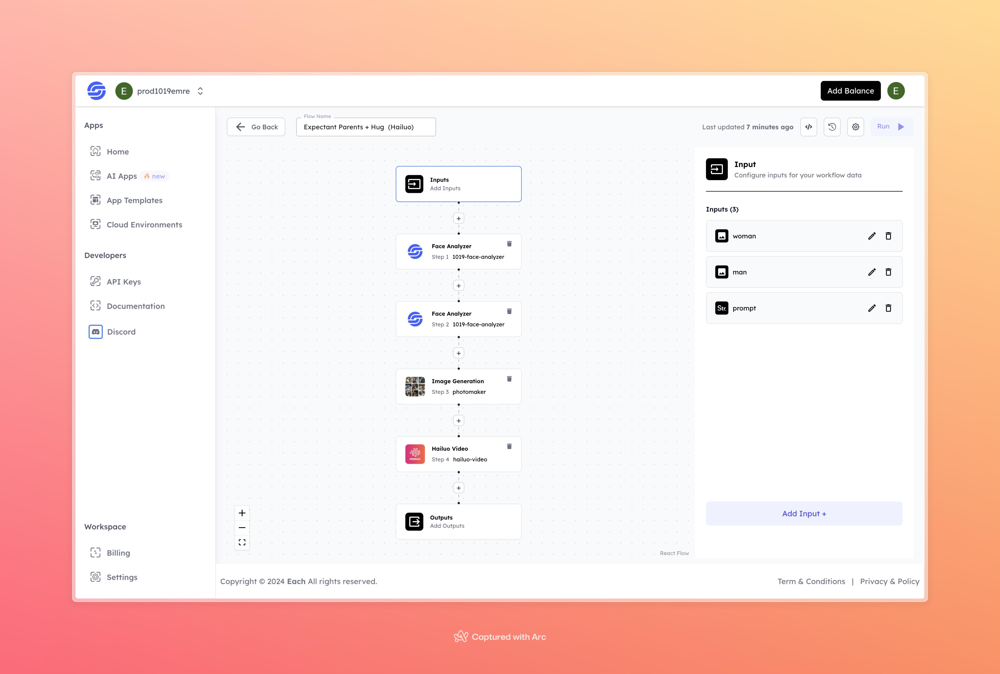

# AI Expectant Parents + Hug with Hailou AI

## Overview
Create AI-generated Expectant Parents + Hug scenes with Hailou AI using Eachlabs workflows—ideal for seamless integration into your web and mobile applications with Eachlabs API.

## Features
- **Face Analysis** to customize expressions and facial features
- **AI Image Generation** of an expectant couple hugging
- **Video Creation** with Hailuo, turning the static image into a dynamic moment

## Inputs

### 1. `woman`
- **Type:** File
- **Title:**  Woman
- **Component:** Image Upload

**Description:** Upload an image of the expectant mother. The system will analyze this image and use it for generating the final photo.

### 2. `man`
- **Type:** File 
- **Title:** Man
- **Component:** Image Upload

**Description:** Upload an image of the expectant father. The system will analyze this image and use it for generating the final photo.

### 3. `prompt`
- **Type:** String
- **Title:** Prompt
- **Component:** Input field

**Description:** Provide a short description or prompt guiding the scene or style of the generated image and video. For example: "Expectant parents hugging under a beautiful sunset."

## Example Input and Output

### Input
- **Woman Image:** 

- **Man Image:** 

- **Prompt:** let this person slowly hug the person on the left

### Output

- **Video:** 
[Output Video](https://storage.googleapis.com/magicpoint/github-outputs/expectant-parents-hug-hailuo-github-output.mp4)
## Conclusion

If you encounter an error, you can join our <b><a href="https://discord.com/invite/yzZD4ZxBPt" target="_blank">Discord</a></b> server.
