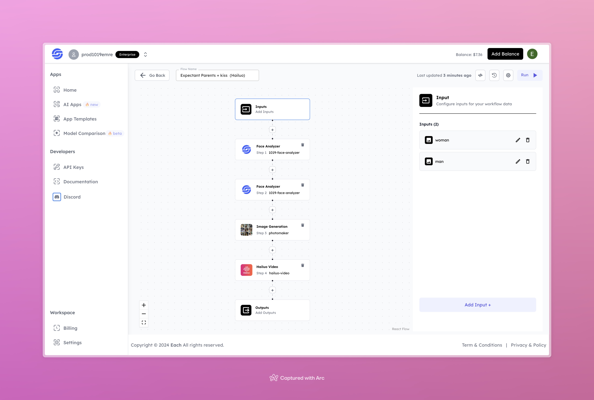

# AI Expectant Parents Kiss with Hailuo AI

## Overview

Create AI Expectant Parents videos using Hailuo AI and our Eachlabs workflow for easy integration into your web and mobile applications with Eachlabs API.

## Features

- **Facial Analysis**: Detailed facial recognition and analysis to enhance realism.
- **Image Generation**: Creates a tender image of expectant parents based on provided facial data.
- **Video Generation**: Converts the generated images into a heartwarming video.
- **Customizable Inputs**: Accepts images of a man and a woman to tailor the output to the specific couple.

## Use Cases

- Pregnancy announcements or reveal videos
- Special keepsakes or visual mementos for expectant parents
- Personalized videos to share on social media or with family

## Inputs

### 1. `woman`
- **Type**: Image File
- **Title**: Woman’s Image
- **Component**: Input field

**Description**: Upload an image of the woman for facial analysis and image generation. This image will be used to represent the female figure in the expectant parents' video.

### 2. `man`
- **Type**: Image File
- **Title**: Man’s Image
- **Component**: Input field

**Description**: Upload an image of the man for facial analysis and image generation. This image will be used to represent the male figure in the expectant parents' video.

## Example

### Input
- **Woman Image**:

 

- **Man Image**:

### Output

[Output Video](https://storage.googleapis.com/magicpoint/github-outputs/expectant-parents-kiss-hailuo-github-output.mp4)

## Conclusion

If you encounter any issues, feel free to reach out to us on our <b><a href="https://discord.com/invite/yzZD4ZxBPt" target="_blank">Discord</a></b> server.
