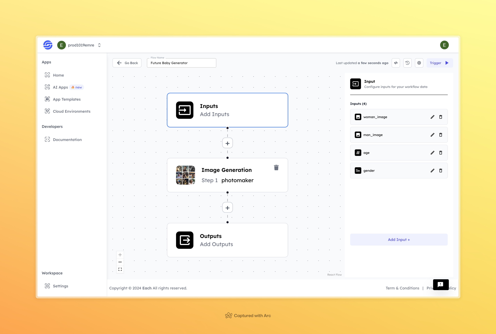

# Future Baby Photo Generator

## Overview
The Future Baby Photo Generator AI uses facial recognition and image analysis techniques to combine the features of two parent images and generate a realistic preview of a potential future child. The model processes facial structure, skin tone, and other characteristics to create a composite image. This tool is designed for casual use, offering a visual prediction of what a child could look like based on the provided inputs. It’s commonly used for social media sharing or as a fun, curiosity-driven tool.

## Features
- **Advanced Image Generation**
- **Realistic and Customizable Baby Images**
- **Fun and Engaging Interaction**

## Use Cases
- Entertainment
- Social Media Sharing
- Memorable Keepsakes

## Inputs

### 1. `woman_image`
- **Type:** String
- **Title:** Woman's Face Image
- **Component:** File

**Description:** This input represents an image file of the woman's face. The file should contain the face image that the model will use to generate a future baby's image. Supported file formats include `.jpg`, `.png`, etc.

### 2. `man_image`
- **Type:** String
- **Title:** Man's Face Image
- **Component:** File

**Description:** This input represents an image file of the man's face. The file should contain the face image that the model will use to generate a future baby's image. Supported file formats include `.jpg`, `.png`, etc.

### 3. `age`
- **Type:** Integer
- **Title:** Age
- **Component:** Input field

**Description:** This input represents the target age for the future baby. This parameter allows for customizable adjustments to the future baby's image, specifying the age you want to visualize.

### 4. `gender`
- **Type:** String
- **Title:** Gender
- **Component:** Input field

**Description:** This input specifies the gender of the future baby. This parameter allows for a more personalized and accurate generation of the baby's image.

## Usage

These inputs are required parameters for running the model. Providing complete and accurate inputs ensures that the model operates correctly and yields expected results.

- **Woman's Face Image**: Upload the face image file.
- **Man's Face Image**: Upload the face image file.
- **Age**: Specify the target age for the future baby.
- **Gender**: Specify the gender of the future baby.

When these inputs are provided, the model will process the uploaded face images and generate a realistic image of a future baby based on the provided parameters.

## Examples

### Input 1

#### Woman's Face Image:

### Input 2

#### Man's Face Image:

### Input 3
**Age:** `5`

### Input 4
**Gender:** `Boy`

### Output

[Download or view the output image](https://storage.googleapis.com/magicpoint/github-outputs/future-baby-github-output.webp)

## Conclusion

If you encounter an error, you can join our <b><a href="https://discord.com/invite/yzZD4ZxBPt" target="_blank">Discord</a></b> server.