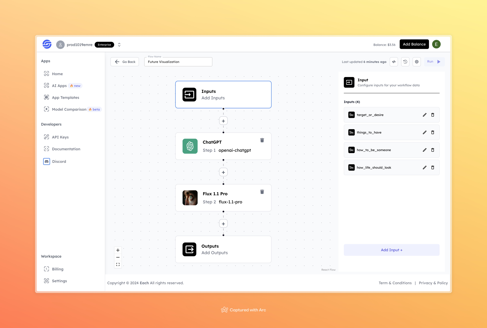

# Future Visualization

## Overview
The Future Visualization flow is designed to help users articulate their aspirations, goals, and vision for life. By combining state-of-the-art AI models, this system generates detailed and meaningful outputs based on user inputs. It enables users to explore their desires and visualize their future in a structured manner.

## Features
- **Customizable Inputs**: Tailor your input to focus on specific life aspects.
- **Advanced AI Models**: Leverages cutting-edge AI technologies for meaningful and accurate results.
- **Actionable Insights**: Generates results that are both reflective and practical.

## Use Cases
- Define and refine personal or professional goals.
- Gain clarity on how to achieve life aspirations.
- Visualize and map out an ideal future with actionable steps.

## Inputs

### 1. `target_or_desire`
- **Type:** String  
- **Title:** Target or Desire  
- **Component:** Text Input  

**Description:** Specify the main goal or desire you want to visualize.

### 2. `things_to_have`
- **Type:** String  
- **Title:** Things to Have  
- **Component:** Text Input  

**Description:** Describe the material or intangible items you want to include in your vision.

### 3. `how_to_be_someone`
- **Type:** String  
- **Title:** How to Be Someone  
- **Component:** Text Input  

**Description:** Define the traits or qualities you aspire to embody.

### 4. `how_life_should_look`
- **Type:** String  
- **Title:** How Life Should Look  
- **Component:** Text Input  

**Description:** Provide a description of your ideal life scenario.

## Example 

### Input
- **Target or Desire:** To become a successful entrepreneur  
- **Things to Have:** A technology company that I designed myself  
- **How to Be Someone:** By working consistently every day and managing my time effectively 
- **How Life Should Look:** A life where I can travel freely and be surrounded by people I love

### Output
- **Generated Visualization:** 

  

## Conclusion

If you encounter an error, you can join our <b><a href="https://discord.com/invite/yzZD4ZxBPt" target="_blank">Discord</a></b> server.
