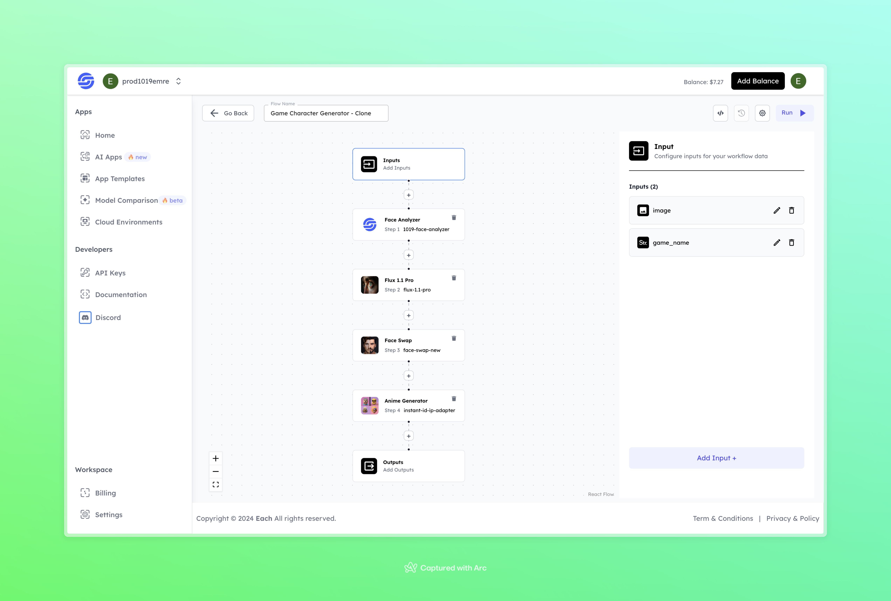

# AI Game Character Generation Workflow with Flux

## Overview
Create AI Game Characters effortlessly with Flux, powered by Eachlabs workflows—ideal for seamless integration into your web and mobile applications with Eachlabs API.

## Features
- **Face Analysis**: Analyzes the face features with the 1019-Face-Analyzer model.
- **Flux 11 Pro**: Applies professional enhancements to the image.
- **Face Swap**: Integrates the character’s face with a different look for customization.
- **Anime Generator**: Adds anime-style effects to the character image.

## Use Cases
- Creating game-style character images for various media or content projects.
- Personalizing characters for themed games or digital content.

## Inputs

### 1. image
- **Type:** File
- **Description:** Upload the image to be used for character generation.

### 2. game_name
- **Type:** String
- **Description:** Enter the name of the game to set the desired style for the character.

## Example

### Input
- **image:** 

- **game_name:** gta san andreas

### Output
 

## Conclusion
If you encounter an error, you can join our <b><a href="https://discord.com/invite/yzZD4ZxBPt" target="_blank">Discord</a></b> server.
