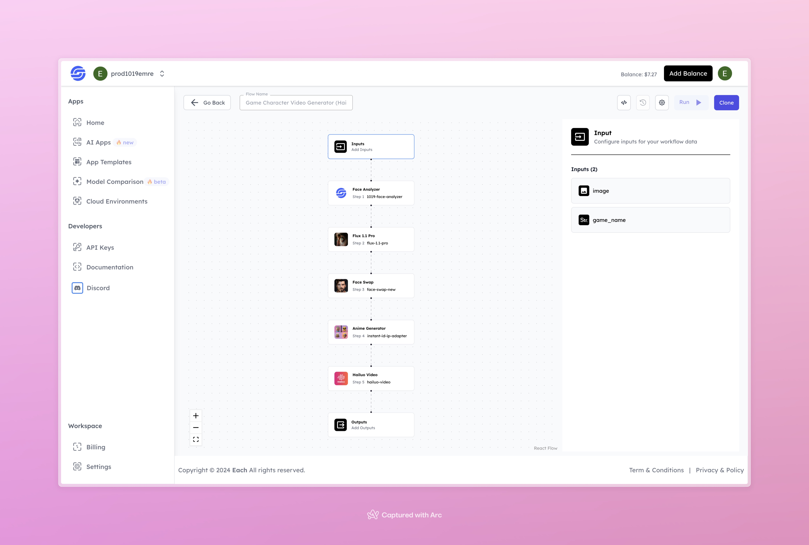

# AI Game Character Video Generation Workflow with with Hailuo AI

## Overview
Generate AI Game Character Videos with Hailuo AI using Eachlabs workflows—perfect for seamless integration into your web and mobile applications with Eachlabs API.

## Features
- **In-depth Face Analysis**
- **Progressive Transformation and Face Swap**
- **Stylized Anime Effect**
- **Video Output for Dynamic Presentation**

## Use Cases
- Creating custom animated game character videos
- Producing personalized avatars with game-inspired designs
- Enhancing social media content with unique character animations

## Inputs

### 1. `image`
- **Type:** File
- **Title:** Image File
- **Component:** File Upload

**Description:** Upload an image file that will be transformed into an animated game character. Supported formats include `.jpg`, `.png`, and other common image types.

### 2. `game_name`
- **Type:** String
- **Title:** Game Name
- **Component:** Input Field

**Description:** Enter the name of the game style to apply to the character in the video.

## Usage

To use the flow, upload a high-quality image and specify the game name for accurate transformation.

- **Image:** Upload a photo of the person to be transformed.
- **Game Name:** Enter the desired game style for the character.

The image will undergo several transformation stages, resulting in an animated video of the character that aligns with the chosen game theme.

## Examples

### Input

**Image:**

- **Game Name:** mortal combat

### Output
[Output Video](https://storage.googleapis.com/magicpoint/github-outputs/game-character-video-generator-hailuo-github-output.mp4)

## Conclusion

If you encounter an error, you can join our <b><a href="https://discord.com/invite/yzZD4ZxBPt" target="_blank">Discord</a></b> server.
