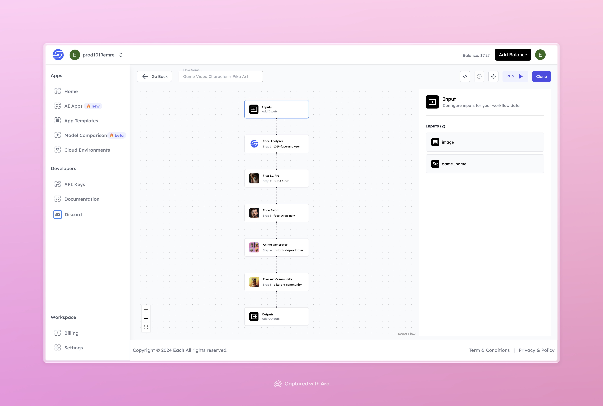

# Game Character Generator + Pika Art

## Overview

With Game Character Generator + Pika Art, users can transform their uploaded photos into game-themed characters. This flow uses multiple AI models to analyze and stylize the image, reshaping it according to the chosen game theme. It’s the perfect tool for anyone looking to create personalized, game-inspired characters.

## Features
- **Face Analysis for Enhanced Personalization**
- **Multi-Stage Image Transformation**
- **High-Quality and Unique Game-Style Character Output**

## Use Cases
- Personalizing characters for gaming or social media profiles
- Generating creative content with unique game and art styles
- Adding artistic stylization to personal photos

## Inputs

### 1. `image`
- **Type:** File
- **Title:** Image File
- **Component:** File Upload

**Description:** This input requires an image file that will be transformed into a game-style character. Supported formats include `.jpg`, `.png`, and other standard image types.

### 2. `game_name`
- **Type:** String
- **Title:** Game Name
- **Component:** Input Field

**Description:** Enter the name of the game style to apply to the character.

## Usage

To use the flow effectively, upload a high-quality image and specify the game name for accurate transformation.

- **Image:** Upload a photo of the person you want to turn into a game character.
- **Game Name:** Enter the name of the game style you wish to apply.

The image will go through multiple transformation steps, resulting in a stylized character that aligns with the chosen game theme.

## Examples

### Input

- **Image:**

- **Game Name:** gta san andreas

### Output
[Output Video](https://storage.googleapis.com/magicpoint/github-outputs/game-video-character-generator-pika-github-output.mp4)

## Conclusion

If you encounter an error, you can join our <b><a href="https://discord.com/invite/yzZD4ZxBPt" target="_blank">Discord</a></b> server.