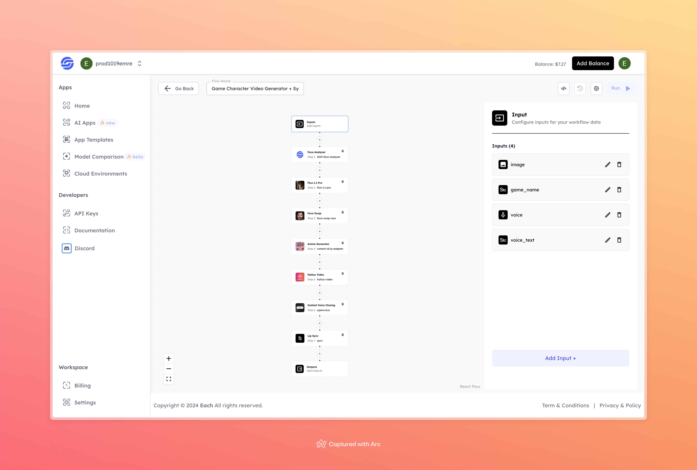

# Game Character Video Generator + Sync

## Overview
The Game Character Video Generator + Sync tool helps bring a character photo to life in the style of a selected game, creating a video. This tool combines features like face analysis, face swapping, and lip sync to give the character an authentic look and feel.

## Features
- **Face Analysis** using 1019-Face-Analyzer for face evaluation
- **Face Swap** to transform the character based on the photo
- **Anime Generation** to add anime-style effects
- **Voice Cloning** to add character voice
- **Lip Sync** to synchronize video and audio

## Use Cases
- Bringing game characters to life as videos
- Creating character videos for entertainment and content creation

## Inputs

### 1. image
- **Type:** File
- **Description:** Upload the image to be used as the character.

### 2. game_name
- **Type:** String
- **Description:** Enter the name of the game for video creation.

### 3. voice
- **Type:** Voice File
- **Description:** Upload a voice file for the character’s voice.

### 4. voice_text
- **Type:** String
- **Description:** Enter the text that the character should say.

## Example 

### Input
- **image:** 

 

- **game_name:** gta san andreas
- **voice:** 
[Input Voice](https://storage.googleapis.com/magicpoint/global_inputs/each-audio.mp3)

- **voice_text:** Welcome to the Game character video generator flow created with synclabs

### Output
[Output Video](https://storage.googleapis.com/magicpoint/github-outputs/game-video-generator-sync-github-output.mp4)

## Conclusion
If you encounter an error, you can join our <b><a href="https://discord.com/invite/yzZD4ZxBPt" target="_blank">Discord</a></b> server.
