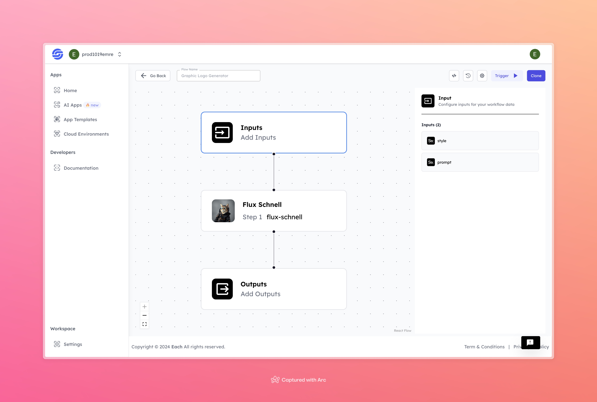

# Graphic Logo Generator

    

## Overview
Looking to create stunning logos effortlessly? Graphic Logo Generator AI helps you craft unique logos with just a few clicks. Perfect for designers, marketers, and business owners to bring their brand vision to life instantly.

## Features
- **Diverse Design Styles**
- **Customizable Text**
- **User-Friendly Interface**

## Use Cases
- Business logo creation
- Branding identity design
- Marketing campaign visuals

# AI Model Execution Inputs

This document provides explanations for the execution inputs required by your AI model.

## Inputs

### 1. `style`
- **Type:** String
- **Title:** Logo Style
- **Component:** Input field

**Description:** This input represents the style of the logo that the model will generate. Users can choose from a variety of styles (e.g., modern, classic, minimalist), and the model will create a logo reflecting that style.

### 2. `prompt`
- **Type:** String
- **Title:** prompt
- **Component:** Input field

**Description:** This input represents the text that will appear in the logo. The text entered by the user will be included in the logo created by the model.

## Usage

These inputs are required parameters for running the model. Providing complete and accurate inputs ensures that the model operates correctly and yields the expected results.

- **style:** Specify the desired logo style.
- **prompt:** Enter the text to be included in the logo.

When these inputs are provided, the model will generate a custom logo in the specified style containing the given text.

## Examples

### Input
- **style:** Futuristic
- **prompt:** Motorcycle silhouette with speed lines

### Output

  

By using the Graphic Logo Generator AI model, save time and create unique logos, making your workflow more efficient and creative.