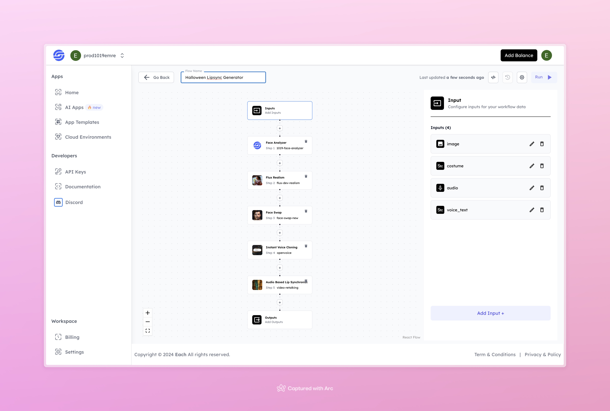

# Halloween Lipsync Generator 

## Overview
The Halloween Lipsync Generator with Hailuo lets you create fun, spooky videos with Halloween vibes. You start by uploading a photo, picking a costume style, and adding an audio file or text for the character to say. The tool then transforms the image and syncs the lips with the audio, giving you a custom Halloween clip.

## Features
- **Face Analysis** with Face Analyzer
- **Realistic Transformation** using Flux Realism
- **Halloween Costume Application** using Face Swap
- **Voice Cloning** with Instant Voice Cloning
- **Lip Sync** using Audio-Based Lip Synchronization

## Use Cases
- Create unique, Halloween-themed videos with custom lip-synced dialogue
- Send fun, spooky greetings to friends and family
- Use for social media content with a Halloween twist

## Inputs

### 1. `image`
- **Type:** File 
- **Title:** Image
- **Component:** Image Upload

**Description:** Upload a clear photo that will be transformed with the Halloween theme.

### 2. `costume`
- **Type:** String
- **Title:** Costume
- **Component:** Input field

**Description:** Choose a Halloween costume style to apply to the character in the image.

### 3. `audio`
- **Type:** File 
- **Title:** Audio
- **Component:** Audio Upload

**Description:** Upload an audio file with the desired voice for the character.

### 4. `voice_text`
- **Type:** String
- **Title:** Voice Text
- **Component:** Text Input

**Description:** Alternatively, type the text you want the character to say. This will be used with the voice cloning model.

## Example 

### Input
- **Image:**

- **Costume:** Suit
- **Audio:** 
[ Voice Input](https://storage.googleapis.com/magicpoint/inputs/audio.wav)

- **Voice Text:** As darkness falls, whispers rise… Secrets hidden in shadows come to life in the eerie magic of Halloween.

### Output
- **Video:** 
[ Video Output](https://storage.googleapis.com/magicpoint/github-outputs/halloween-lipsync-github-output.mp4)

## Conclusion

If you have any questions or need help, feel free to join our <b><a href="https://discord.com/invite/yzZD4ZxBPt" target="_blank">Discord</a></b> community to connect with others and get support.
