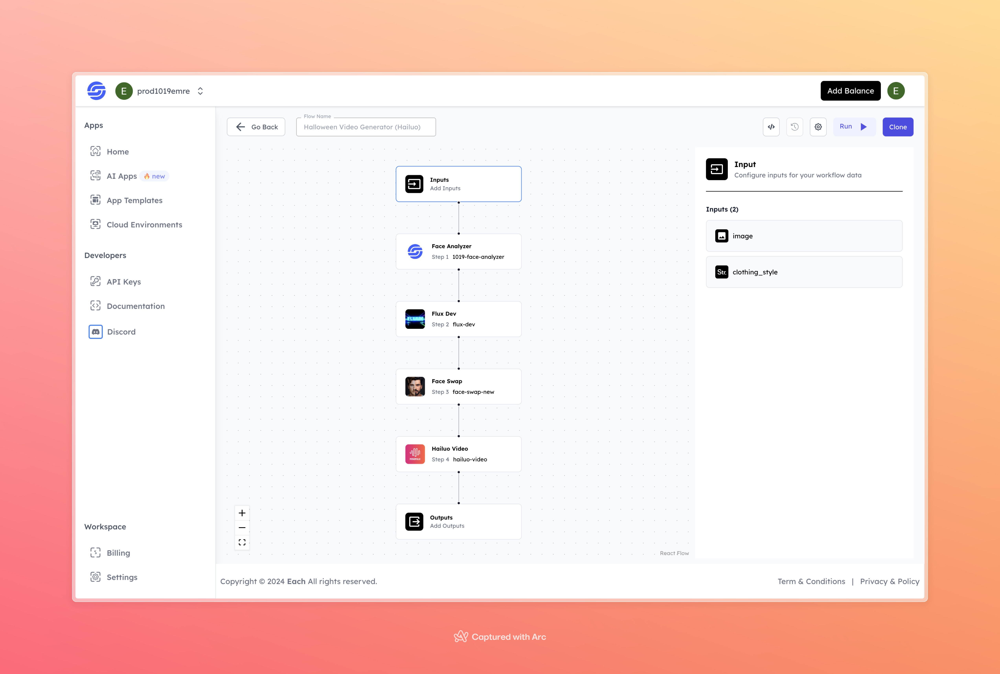

# Halloween Video Generator with Hailuo

## Overview
The Halloween Video Generator with Hailuo is a tool that helps you create fun, spooky Halloween videos. Just upload a photo and pick a clothing style, and the tool will analyze the face, add Halloween effects, and turn it into a unique video.

## Features
- **Face Analysis** with 1019 Face Analyzer
- **AI-Based Transformation** using Flux Dev
- **Face Swapping** with Face Swap
- **Halloween Video Creation** using Hailuo Video

## Use Cases
- Generating Halloween-themed videos for social media or personal enjoyment
- Creating spooky character videos for Halloween events
- Transforming personal images into Halloween characters

## Inputs

### 1. `image`
- **Type:** File
- **Title:** Image
- **Component:** Image Upload

**Description:** Upload an image that will be transformed into a Halloween-themed character for the video.

### 2. `clothing_style`
- **Type:** String
- **Title:** Clothing Style
- **Component:** Input Field

**Description:** Select a clothing style that will influence the costume and overall Halloween transformation of the character in the video.

## Example 

### Input
- **Image:** 

- **Clothing Style:** suit
### Output
- **Video:** 
[Output Video](https://storage.googleapis.com/magicpoint/github-outputs/halloween-video-generator-hailuo-github-output.mp4)

## Conclusion

If you encounter an error, you can join our <b><a href="https://discord.com/invite/yzZD4ZxBPt" target="_blank">Discord</a></b> server.
