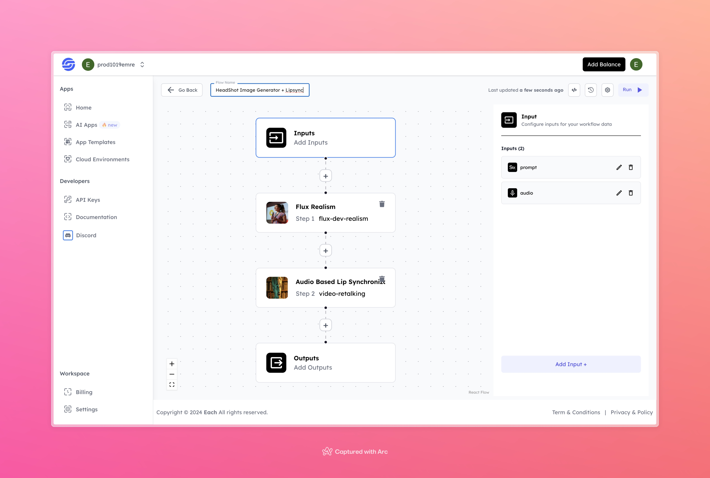

# Headshot AI Image Generation Workflow with Lipsync

## Overview
Create Headshot AI Images with Lipsync using Eachlabs workflows and Hailou AI—perfect for seamless integration into your web and mobile applications with Eachlabs API.

## Features
- **AI-Generated Realistic Headshots**: Creates lifelike headshot images based on text inputs.
- **Audio-Based Lip Synchronization**: Synchronizes character's lip movements with provided audio, creating a video with natural lip movement.
- **Flexible Inputs**: Customizable prompt and audio inputs for varied content generation.
  
## Use Cases
- Virtual avatars for video content
- Personalized character-based video creation
- Automated video generation for marketing or social media content

## Inputs

### 1. `prompt`
- **Type**: String
- **Title**: Description Prompt
- **Component**: Input field

**Description**: The text input that describes the desired characteristics of the headshot image (e.g., "A 30-year-old woman with curly hair, smiling, in a business suit").

### 2. `audio`
- **Type**: Audio File
- **Title**: Audio File
- **Component**: Input field

**Description**: The audio input for lip synchronization. This audio will be used to animate the headshot, synchronizing the lips to match the speech in the audio.

## Example

### Input
- **Prompt**: "A photo of a man, headshot, realistic"
- **Audio**: [ Voice Input](https://storage.googleapis.com/magicpoint/global_inputs/each-audio.mp3)

### Output
[ Output Video](https://storage.googleapis.com/magicpoint/github-outputs/headshot-image-generator-github-output.mp4)

## Conclusion
If you encounter an error, you can join our <b><a href="https://discord.com/invite/yzZD4ZxBPt" target="_blank">Discord</a></b> server.
