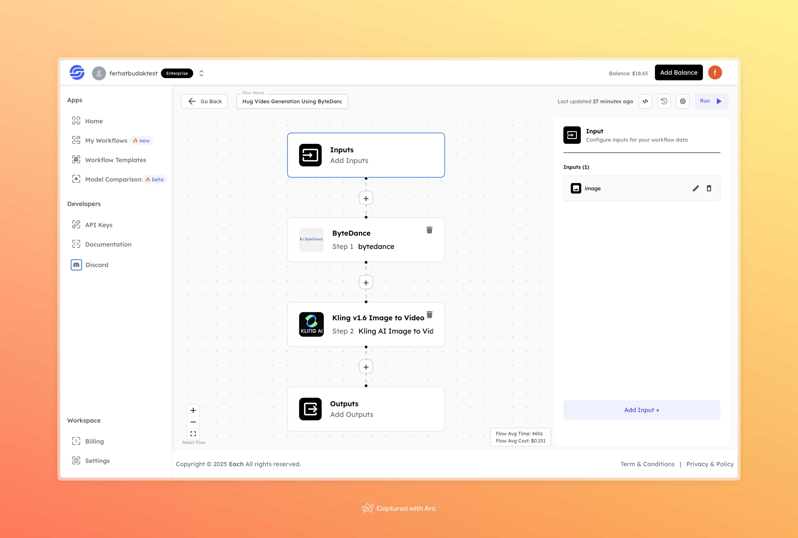

# Hug Video Generation Using ByteDance

## Overview
Effortlessly create realistic and emotional videos using the Hug Video Generation workflow powered by ByteDance. Convert static images into dynamic and heartwarming videos with ease.

## Features
- **AI-Driven Image-to-Video Conversion**
- **High-Quality and Realistic Outputs**
- **Simple and Intuitive Workflow**

## Use Cases
- Creating personalized videos for special moments
- Generating dynamic content for social media
- Adding life to static images for storytelling

## Inputs

### 1. `image`
- **Type:** File (Image)
- **Title:** Input Image
- **Component:** File upload

**Description:** Upload an image to be used as the base for video generation. The model transforms this input into a short, engaging video.

## Usage

Provide the required input parameters to run the workflow effectively. Ensure that the uploaded image is clear and relevant to achieve the best video results.

## Examples

### Input
**Image:** [Click here to view the input image](https://storage.googleapis.com/magicpoint/inputs/hailuo-i2v-live-input.jpeg)

### Output
**Generated Video:** [Click here to view the output video](https://storage.googleapis.com/magicpoint/outputs/hug-video-generation-using-bytedance-readme-output.mp4)

## Conclusion
If you have any questions or encounter issues, feel free to join our <b><a href="https://discord.com/invite/yzZD4ZxBPt" target="_blank">Discord</a></b> server for assistance.
