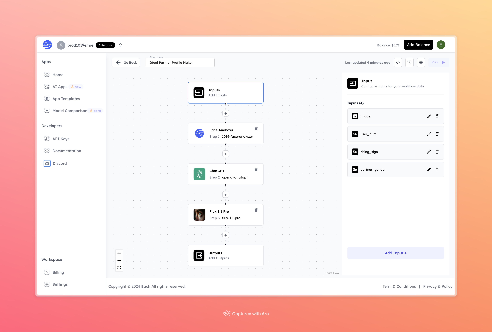

# Ideal Partner AI Image Generation with Flux

## Overview
Create AI image using Flux model and our Eachlabs workflow for easy integration into your web and mobile applications with Eachlabs API.

## Features
- **Face Analysis**: Extracts key features from the uploaded image to personalize the output.
- **ChatGPT Interaction**: Generates insights and descriptions based on user preferences and inputs.
- **Flux 1.1 Pro**: Produces a realistic and stylized image of the ideal partner.

## Use Cases
- Fun and personalized gift creation.
- Exploring creative representations of personality-based preferences.
- Social media content generation.

## Inputs

### 1. `image`
- **Type:** File 
- **Title:** Image
- **Component:** Image Upload

**Description:** Upload a photo of yourself to help the system analyze your features.

### 2. `user_burc`
- **Type:** Text
- **Title:** Your Zodiac Sign
- **Component:** Dropdown

**Description:** Provide your zodiac sign to personalize the partner's traits.

### 3. `rising_sign`
- **Type:** Text
- **Title:** Your Rising Sign
- **Component:** Dropdown

**Description:** Enter your rising sign to add more personality details to the output.

### 4. `partner_gender`
- **Type:** Text
- **Title:** Partner Gender
- **Component:** Dropdown

**Description:** Specify the gender of the ideal partner for the output.

## Example 

### Input
- **Image:** 

- **User Burc:** Crab
- **Rising Sign:** Spring
- **Partner Gender:** Female

### Output
- **Ideal Partner Representation**:

## Conclusion

If you encounter an error, you can join our <b><a href="https://discord.com/invite/yzZD4ZxBPt" target="_blank">Discord</a></b> server.
