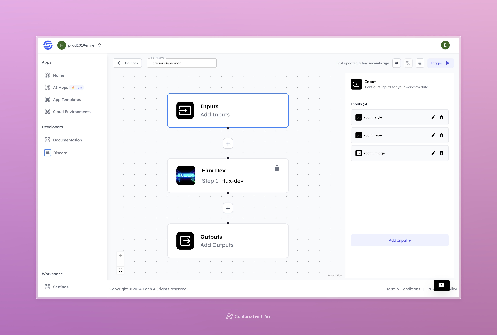

# Interior AI Image Generation Workflow

## Overview

Create Interior Design AI Images using Eachlabs workflows—easily integrate custom interior design visuals into your web and mobile applications with Eachlabs API.

## Features
- **Dynamic Room Styles**
- **High-Quality Outputs**
- **User-Friendly Interface**

## Use Cases
- Home renovation visualization
- Real estate marketing
- Interior design projects

## Inputs

### 1. `room_style`
- **Type:** String
- **Title:** Room Style
- **Component:** Input field

**Description:** This input specifies the design style for the room, such as modern, vintage, or minimalist.

### 2. `room_type`
- **Type:** String
- **Title:** Room Type
- **Component:** Input field

**Description:** This input indicates the type of room to be redesigned (e.g., living room, bedroom, kitchen).

### 3. `room_image`
- **Type:** Image
- **Title:** Room Image
- **Component:** File

**Description:** Upload an image of the room you want to transform. Supported file formats include `.jpg`, `.png`, etc.

## Usage

These inputs are required parameters for running the model. Providing complete and accurate inputs ensures that the model operates correctly and yields expected results.

- **Room Style**: Specify the desired design style.
- **Room Type**: Indicate the type of room.
- **Room Image**: Upload the image of the room.

When these inputs are provided, the model will process the uploaded room image according to the specified style and type.

## Examples

### Input 1
- **Room Style:** Modern

### Input 2
- **Room Type:** Living Room

### Input 3
- **Room Image:** 

### Output

## Conclusion

If you encounter an error, you can join our <b><a href="https://discord.com/invite/yzZD4ZxBPt" target="_blank">Discord</a></b> server.
