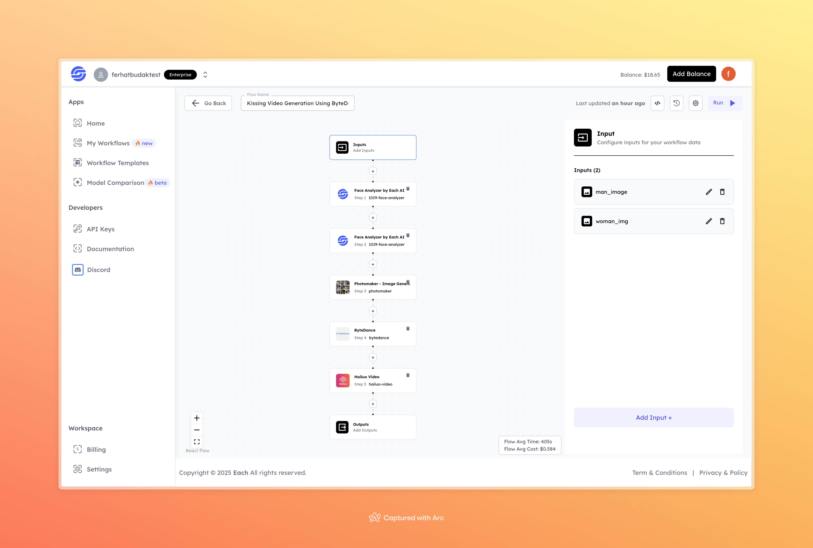

# Kissing Video Generation Using ByteDance

## Overview
Create emotional and realistic kissing videos using the **Kissing Video Generation** workflow powered by ByteDance. This workflow seamlessly processes input images of a man and a woman to generate dynamic and heartwarming videos.

## Features
- **AI-Driven Video Generation**
- **High-Quality Outputs**
- **Realistic and Emotionally Expressive Videos**

## Use Cases
- Personalized videos for special occasions
- Social media content creation
- Visual storytelling and romantic expressions

## Inputs

### 1. `man_image`
- **Type:** File (Image)
- **Title:** Man's Image
- **Component:** File upload

**Description:** Upload the image of the man to be used in the video generation process. Ensure the image is clear and of good quality for the best output.

### 2. `woman_img`
- **Type:** File (Image)
- **Title:** Woman's Image
- **Component:** File upload

**Description:** Upload the image of the woman to be included in the video generation process. A clear and high-quality image will yield optimal results.

## Usage

1. Prepare and upload clear images of a man and a woman as inputs.
2. Run the workflow to process the images and generate the video.
3. Download the output video to view and share.

## Examples

### Input
- **Man's Image:** [Sample Input](https://storage.googleapis.com/magicpoint/models/man.png)
- **Woman's Image:** [Sample Input](https://storage.googleapis.com/magicpoint/models/women.png)

### Output
- **Generated Video:** [Click here to view the output video](https://storage.googleapis.com/magicpoint/outputs/kissing-video-generation-using-bytedance-readme-output.mp4)

## Conclusion
If you encounter any issues or need assistance, join our <b><a href="https://discord.com/invite/yzZD4ZxBPt" target="_blank">Discord</a></b> server for support.
