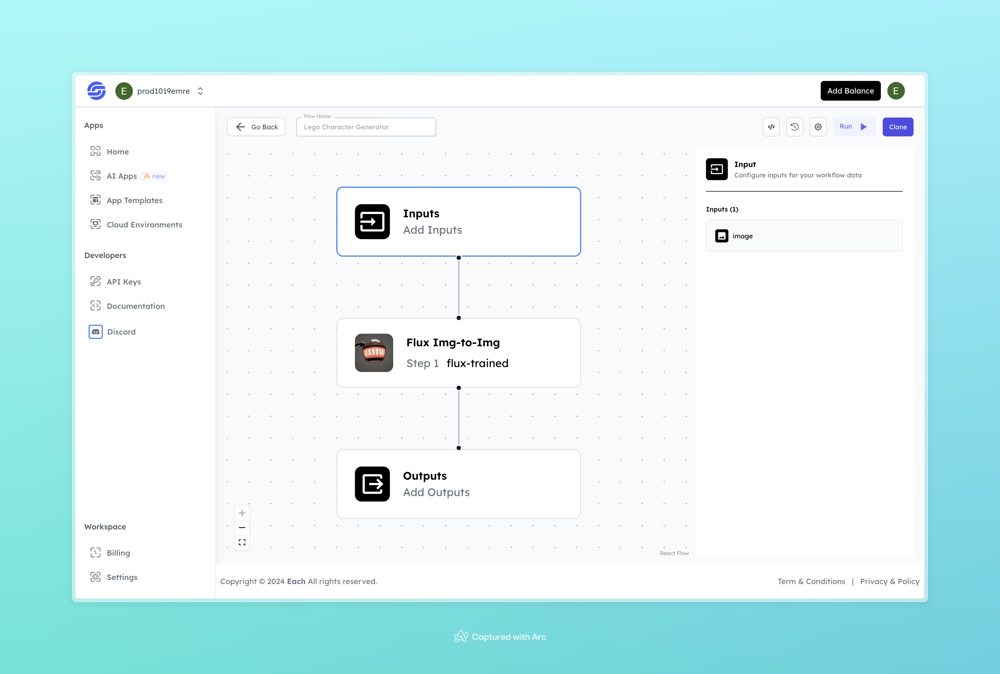

# AI Lego Character Generation Workflow with Hailou AI

## Overview
Generate AI Lego Characters with Hailou AI using Eachlabs workflows—perfect for seamless integration into your web and mobile applications with Eachlabs API.

## Features
- **Image-to-Image Transformation**: Converts uploaded images into Lego-style characters.
- **Easy-to-Use**: Simply upload an image and receive a transformed character as output.

## Use Cases
- Personalize your social media profile with a unique Lego character
- Use as a fun gift for friends or family by converting their photos into Lego characters
- Make your presentations or documents more engaging with customized Lego-style avatars

## Inputs

### 1. `image`
- **Type:** File 
- **Title:** Image
- **Component:** Image Upload

**Description:** Upload a clear, front-facing photo that will be transformed into a Lego character.

## Example 

### Input
- **Image:** 

### Output
- **Lego Character Image**:

## Conclusion

For any questions, feel free to connect with us on our <b><a href="https://discord.com/invite/yzZD4ZxBPt" target="_blank">Discord</a></b> channel.
