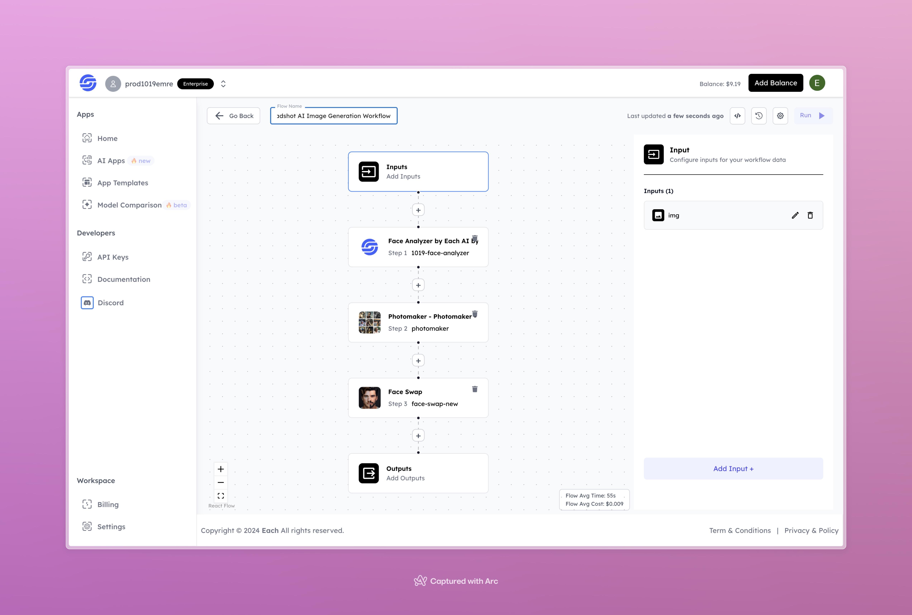

# LinkedIn Headshot AI Image Generation Workflow

## Overview
Generate LinkedIn Headshot AI Images using Eachlabs workflows—seamlessly integrate professional headshot generation for LinkedIn profiles into your web and mobile applications with Eachlabs API.

---

## Features

- **Face Analyzer by Each AI**: Analyzes facial features for accurate processing.  
- **Photomaker**: Generates enhanced and polished headshots suitable for LinkedIn profiles.  
- **Face Swap**: Integrates and refines the final output with professional-grade precision.  

---

## Inputs

### 1. `img`  
- **Type:** File  
- **Title:** Input Image  
- **Component:** Image Upload  

**Description:** Upload the image to transform it into a professional LinkedIn headshot.

---

## Example Input and Output

### Input  
  

---

### Output  
  

---

## Conclusion

If you encounter an error, you can join our <b><a href="https://discord.com/invite/yzZD4ZxBPt" target="_blank">Discord</a></b> server.