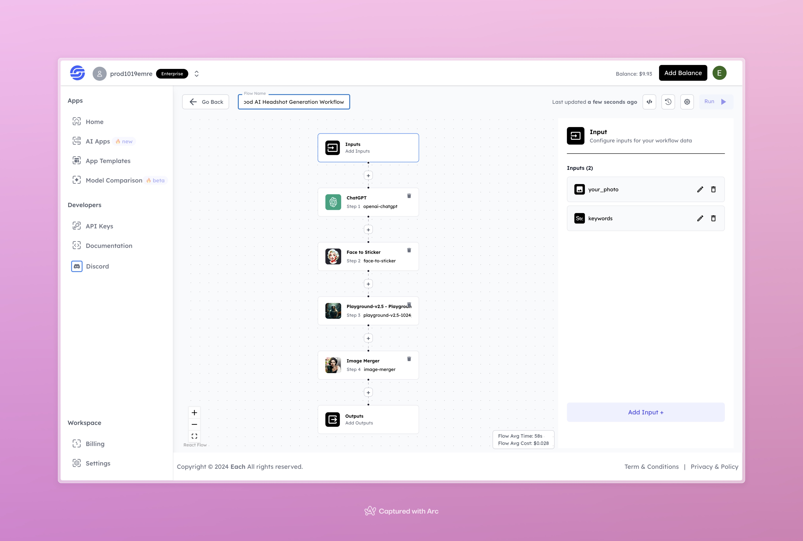

# Mood AI Headshot Generation Workflow

## Overview

Create Mood-Based AI Headshots using Eachlabs workflows—easily integrate personalized headshot generation based on different moods into your web and mobile applications with Eachlabs API.

---

## Features

- **ChatGPT**: Processes input keywords to define the mood and headshot style.
- **Face to Sticker**: Converts input face into a sticker format for further processing.
- **Playground-v2.5**: Enhances and generates high-quality AI images based on the mood and inputs.
- **Image Merger**: Combines generated images to produce the final AI headshot output.

---

## Inputs

### 1. `your_photo`  
- **Type:** File  
- **Title:** Input Photo  
- **Component:** Image Upload  

**Description:** Upload the photo of the individual to generate a personalized AI headshot.

### 2. `keywords`  
- **Type:** String  
- **Title:** Mood Keywords  
- **Component:** Text Input  

**Description:** Provide keywords to define the mood or style for the headshot (e.g., professional, happy, vibrant).

---

## Example Input and Output

### Input  

**Keywords:** Sad, Chaos, Lava

---

### Output  

---

## Conclusion

If you encounter an error, you can join our <b><a href="https://discord.com/invite/yzZD4ZxBPt" target="_blank">Discord</a></b> server.